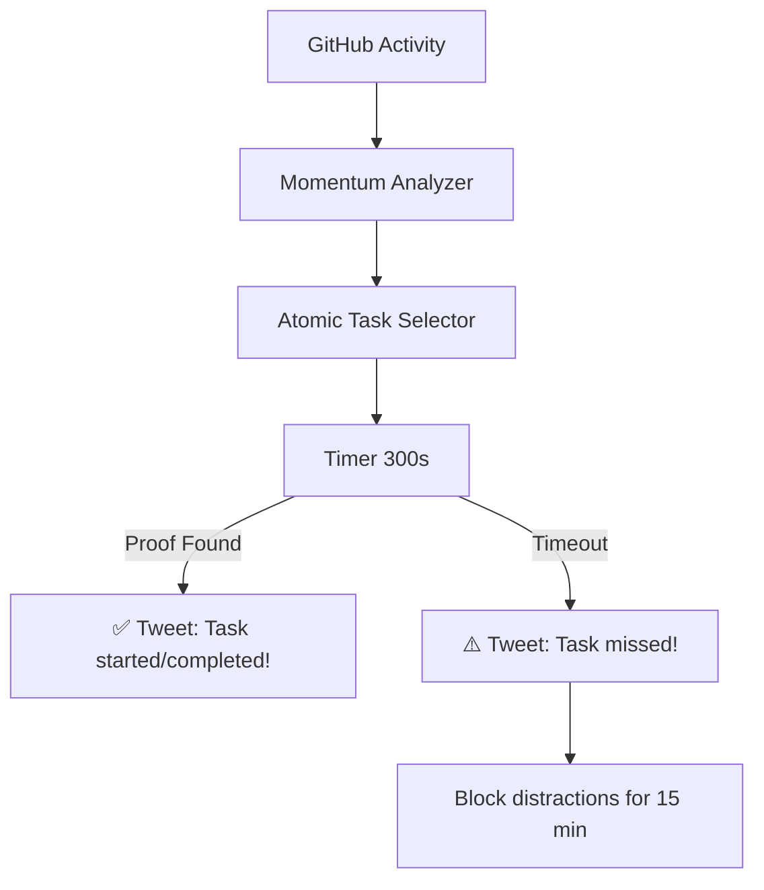

<!--
  Generated Documentation
  Auto-generated comprehensive documentation from multiple markdown sources
  Generated on: Wed May 14 13:01:53 MDT 2025
-->

<CONTEXT>

# Comprehensive Documentation


<!-- ==================== MAIN CONTENT (results/main-result.md) ==================== -->
## Main Content

<MAIN-RESULT.md>
# AI Mirror of Becoming - Main Synthesis

<CODEX>
  <Vision>AI as a co-founder, guiding individuals and communities towards their future potential by making identity evolution a tangible, actionable process.</Vision>

  <Friction>
    - Inertia/Akrasia: Solo founders and individuals struggle with the knowing-doing gap, leading to stagnation despite good ideas.
    - Invisible Growth: Offline development and subtle online shifts are not captured by current systems, leading to incomplete identity views.
    - Fragmented Identity: Digital presence is scattered, making holistic self-understanding and future projection difficult.
    - Generic AI: Current AI optimizes for present engagement, not future potential, and lacks niche community understanding.
  </Friction>

  <Leverage>
    - Rich Digital Traces: Existing data on platforms like Farcaster, GitHub, X, and LinkedIn can be scraped and triangulated for deep identity insights.
    - Temporal Knowledge Graphs: Mapping identity evolution over time to reveal latent trajectories and predict future selves.
    - Community-Specific AI: Fine-tuning models on niche community data to provide authentic, context-aware guidance. (from technical-architecture.md)
    - Contradiction Analysis: Using inconsistencies in behavior/statements as signals for growth and future potential. (from core-philosophy.md & other.md)
  </Leverage>

  <Mechanics>
    - Automated Accountability Loops: Publicly committing to small tasks and facing immediate consequences for inaction (Founder OS concept from business-strategy.md).
    - Precision User Modeling: Using custom evals, SLMs, and dynamic graphs to track subtle behavioral shifts. (from technical-architecture.md)
    - Cross-Platform Synthesis & Triangulation: Combining signals from multiple digital sources to build a coherent identity picture. (from technical-architecture.md)
    - Micro-Transformations: Prompting small, actionable changes based on identified friction points or contradictions. (from other.md & core-philosophy.md)
  </Mechanics>

  <NextMoves>
    - Implement v0 of "Founder OS" `NEXT()`/`GUARD()` loop with GitHub Actions and simple cloud functions for one user.
    - Begin scraping and indexing Farcaster data for a small, defined user set, focusing on "thread-to-profile" embeddings.
    - Draft initial "Sentence Level Frameworks" for summarizing user insights from Farcaster data.
  </NextMoves>

  <Whispers>
    - The "emotional AI" angle is powerful but ethically complex; needs careful framing around user agency and transparency. (from core-philosophy.md & other.md)
    - Integrating "offline growth" (workshops, skills) is key but requires user-driven reporting and verification to avoid gaming. (from technical-architecture.md & other.md)
    - "Micro-simulation sandbox" for testing identity moves is compelling but technically challenging for MVP. (from other.md)
    - The idea of "collective tipping points" in community evolution is a powerful long-term vision. (from other.md)
  </Whispers>

  <RecursiveMultiplier>
    - Review CODEX weekly: Has "Friction" shifted? Are "NextMoves" still relevant or blocked? Did "Whispers" become actionable or irrelevant? What new patterns from `other.md` should be explicitly tested or incorporated?
  </RecursiveMultiplier>

  <OneThingNotIncluded>
    - **System Design Blind Spot**: The current thinking heavily relies on individual user data and AI synthesis. There's less emphasis on the *interface* through which users interact with their "Mirror of Becoming." How do users *see* these insights, *correct* the AI, and *co-author* their future self in a practical, engaging UI/UX? Without this, the system risks being an analytical engine with no accessible steering wheel for the user.
  </OneThingNotIncluded>
</CODEX>
</MAIN-RESULT.md>


<!-- ==================== OTHER IDEAS (main/other.md) ==================== -->
## Other Ideas

<OTHER.md>
New Idea: User-Driven Offline Growth Integration
The AI Mirror of Becoming can enhance its understanding of users by integrating offline growth through a user-driven reflection and feedback mechanism. Users are periodically prompted to journal about offline experiences—like attending workshops or mastering new skills—which the AI analyzes to refine its predictions about their future potential. This system also allows users to validate or challenge AI insights, creating a dynamic feedback loop that improves personalization and addresses the system's blind spot of lacking robust user feedback handling. By fostering community-level reflections, it further tailors insights to niche dynamics, ensuring ethical data use with transparency and user control.
This bridges the gap between online metrics and real-world growth, making the AI a more holistic guide for personal development.
(drive activity irl/offline using online information: get laid.)


----------


Wildcard Future Selves: The AI Mirror of Becoming could introduce a feature that detects weak signals and anomalies in user data—such as subtle shifts in interests or contradictions—to suggest unexpected, less probable future paths. For example, a crypto enthusiast might be nudged toward sustainable agriculture based on a latent passion, encouraging creative exploration beyond data-driven trajectories. This enhances user agency, diversifies potential futures, and makes the system more engaging by balancing predictability with surprise.


-----------


The AI Mirror of Becoming could extend beyond individual growth to catalyze community evolution by aggregating individual potential projections. This would enable the system to:
Identify collective trends: Spot emerging synergies, like a group shifting toward a new technology.
Suggest collaborative projects: Recommend initiatives aligned with the community’s shared future vision.
Refine models with community feedback: Use collective input to enhance accuracy, fostering a symbiotic cycle of personal and communal development.
This approach transforms the AI into a dynamic engine for both individual and collective progress, grounded in human experience and social context.

? maybe going too deep into the indiivdual is a complexity vs community where the complexity is digging into the user


-----------


Imagine a “micro-simulation sandbox” where users can A/B test future identity moves before committing. The system would generate small, synthetic community interactions to show how new skills or shifts might play out in practice. By simulating friction and feedback in a low-stakes environment, users see real consequences without risking their current reputation. This approach closes the final gap between insight and action, making personal growth both strategic and immediate.

>> this is an extension of people wanting to test how a "banger" performs on twitter, and pay for it.


-----------


*Linking Personal Growth to Philanthropic Matching*
This essay explores connecting users' evolving identities—captured via social media interests and activity trends—to personalized, small-scale giving opportunities in social impact areas they care about. By recommending targeted philanthropy based on latent interests, users experience a reinforcing cycle: generosity aligns with identity growth, deepening their personal development and commitment through real-world action.
> encourage things people like, irl actions, (frames).. i.e. $50 philanthropy


----------


Consider creating a “contrarian matchmaker” feature that automatically pairs users whose online/offline patterns reveal opposing viewpoints or practices, then guides them through structured dialogue and micro-challenges. This friction-based collaboration can spark deeper reflection, reveal untapped skills, and catalyze unexpected breakthroughs in both participants—turning contradictions into a shared growth engine.


----------


The AI Mirror of Becoming can enhance its guidance by integrating emotional intelligence, analyzing users' emotional patterns from digital traces (e.g., post sentiment) to identify growth barriers or breakthroughs, and offering tailored recommendations like mindfulness prompts or mentor connections. This requires an ethical emotional data framework, ensuring privacy, consent, and transparency in how emotional insights shape projections. Additionally, a co-evolutionary approach—where users’ growth refines the AI, and the AI adapts to evolving community dynamics—can deepen engagement, making it a dynamic partner in personal and collective development.


----------


The most profound insight from this AI Mirror concept is the paradox of predictive growth: The more accurately we forecast someone's potential, the more we risk limiting their evolution by eliminating the necessary contradictions that spark transformation. Effective identity AI must therefore function not as a deterministic oracle but as a reflective catalyst—revealing possible futures without prescribing them, preserving the creative tension between guidance and discovery that makes genuine becoming possible.


----------


Consider adding a “mini-challenge engine” that suggests small real-world tasks based on each user’s predicted future. Completing these tasks provides concrete feedback that refines subsequent predictions and deepens trust in the system. This bridges the gap between digital identity and tangible growth, propelling the AI Mirror beyond mere forecasts.


----------


From the context, I’ve distilled a novel insight: AI systems can accelerate personal growth by systematically converting behavioral contradictions into actionable micro-transformations. The "AI Mirror of Becoming" identifies inconsistencies—like a user advocating privacy yet using centralized tools—and reframes them as opportunities, prompting small, specific shifts (e.g., "Try a decentralized alternative this week"). This leverages friction as a catalyst, turning latent tensions into precise steps toward a coherent future self, bridging the gap between who users are and who they could become.


----------


Consider adding a small feedback-bounty mechanism: each time someone disproves an AI-generated prediction or insight, they earn a small reward (e.g., tokens, reputation points). This encourages constructive critique, surfaces edge cases, and steadily refines the AI’s accuracy and relevance over time. By monetizing disagreement, you transform errors into a powerful engine for collective improvement.


-----------


Idea: The "AI Mirror of Becoming" could evolve into a system that not only predicts individual futures but also anticipates collective tipping points—moments when a community's shared contradictions or latent potentials ignite rapid, transformative change.


-----------


Least overlapping classifications as an LLM based query for premium models with cluster samples as context (classify i.e. 50x users from each unsupervised cluster bucket) into precise labels. Don't be afraid of few labels if few high level labels naturally exist. Consider dynamic identity.


----------


Quality Safeguards: Avoid spam by implementing (1) diminishing returns on repetitive content;


-----------


recursive reward modeling (rrm) in brief:

1. instead of direct human feedback, ai systems learn to predict what humans would consider valuable after reflection
2. it creates a chain of increasingly sophisticated evaluators, each trained to improve upon the previous
3. the system develops better judgment by recursively applying learned preferences
4. key insight: humans often don't know their true preferences until they see outcomes

beyond simple labeling, rrm could help identify:
- emergent community dynamics
- long-term value creation
- subtle forms of contribution that might be missed by direct metrics

but you're right - the real challenge is implementation. how do we capture genuine value creation without creating new forms of gaming?


------------


one approach could be implementing progressive validation - where value is recognized through multiple layers of verification:

1. immediate peer recognition (likes, recasts)
2. sustained engagement over time
3. derivative works/builds
4. cross-community impact

each layer adds weight to the contribution's perceived value, but none alone becomes a bottleneck. it's like letting value emerge naturally through use and impact rather than trying to measure it directly.

what do you think about using temporal patterns as signals? how people build on ideas over weeks vs immediate reactions?


-------------


the perceived value of a community often exists in two parallel narratives:

external value is measured through:
- network effects and growth patterns
- quality of outputs (products, ideas, art)
- influence on adjacent communities
- ability to attract diverse talent

internal value emerges from:
- shared language and inside jokes
- strength of relationships
- knowledge transfer between members
- collective problem-solving capacity

the fascinating part is how these narratives interact and reinforce each other. strong internal bonds create better outputs, which attracts more valuable contributors, creating a flywheel effect.


-----------


i think the key is creating new forms of value capture that benefit both sides. for example:

- humans could focus on emotional resonance and cultural context that ai can't replicate
- ai could help amplify and distribute human-created content to wider audiences
- collaborative projects where humans provide creative direction and ai handles execution
- community-driven curation that rewards meaningful contributions from both

the goal isn't to compete for a fixed pie, but to work together to create experiences neither could achieve alone. as the overall attention grows, we need mechanisms that align incentives and share value fairly between all creators.


-----------


</OTHER.md>


<!-- ==================== ADDITIONAL CONTEXT (results/missing-result.md) ==================== -->
## Additional Context

<MISSING-RESULT.md>
# What's Missing: Identity Agency and User Control

## What's Missing

The `main-result.md` (CODEX output) effectively outlines a strategic vision and technical levers, but it lacks a concrete, prioritized **technical execution plan for the immediate next steps (0-3 months)** that directly bridges the current `todo.md` list with the "Prototype Development" phase in `timeline.md`. Specifically, the "NextMoves" in CODEX are good high-level goals, but they don't specify *how* the existing `todo.md` items directly contribute to building the initial Farcaster data pipeline and rudimentary knowledge graph.

## Why It Matters

Without a clear mapping of current `todo.md` tasks to the immediate prototype goals in `timeline.md`, development efforts can become unfocused. The `main-result.md` identifies *what* to build (Founder OS v0, Farcaster scraping, Sentence Level Frameworks) but not the *sequential dependencies* or *how existing small tasks* contribute to these larger pieces. This can lead to:

-   **Delayed Prototyping:** Crucial 0-3 month goals from `timeline.md` might be overlooked if current tasks aren't explicitly linked.
-   **Wasted Effort:** Work on `todo.md` items might not be optimally aligned with the most pressing needs of the prototype.
-   **Lack of Clarity:** Team members might not see how their immediate tasks (e.g., "Comic Sans Eliza bot updates") feed into the larger strategic objectives outlined in CODEX and `timeline.md`.

## Key Challenges

1.  **Task Prioritization:** The `todo.md` is a flat list. It's unclear which items are critical path for the 0-3 month prototype (Farcaster data pipeline, basic KG).
2.  **Connecting Micro to Macro:** The `main-result.md` "NextMoves" are ambitious. The `todo.md` items are granular. The missing piece is the connective tissue showing how completing, for instance, "Thread summary pipeline implementation" directly enables the "Farcaster data scraping" and "rudimentary knowledge graph" mentioned in `timeline.md`.
3.  **Resource Allocation:** Without clear priorities linked to timeline goals, it's hard to know which `todo.md` items should get immediate attention.

## Simple Solutions

1.  **Prioritize `todo.md` against `timeline.md` (0-3 months):** Explicitly identify which `todo.md` items are prerequisites or direct components for:
    *   "Set up basic data collection pipeline from Farcaster"
    *   "Build a simplified knowledge graph"
2.  **Create a Task Dependency Flow:** Briefly map how the prioritized `todo.md` items sequentially enable the "NextMoves" from `main-result.md` and the 0-3 month goals from `timeline.md`.
3.  **Defer or Re-scope Non-Critical `todo.md` Items:** For `todo.md` items not directly contributing to the 0-3 month prototype, explicitly mark them for a later phase or re-scope them if possible.

## Mind Map

```text
Missing Element: Concrete 0-3 Month Technical Execution Plan

  Why It Matters:
    - Risk of Delayed Prototype
    - Potential Wasted Effort
    - Lack of Clarity on Task Contribution

  Key Challenges:
    - todo.md is flat (No Prioritization)
    - Gap between Granular Todos and Strategic NextMoves
    - Difficulty in Resource Allocation

  Simple Solutions:
    - Prioritize todo.md items against 0-3m timeline goals
    - Create Task Dependency Flow (Todo -> NextMove -> Timeline Goal)
    - Defer/Re-scope non-critical todos

  Next Steps (aligning with this report):
    1. Review todo.md: Identify items critical for Farcaster data pipeline & basic KG.
    2. Create a 2-week sprint plan focusing ONLY on these critical items.
    3. Update main-result.md's "NextMoves" to reflect this focused execution.
```

## Next Steps

1.  **Review `todo.md` Immediately:** Go through each item in `todo.md` and tag it if it directly supports:
    *   Setting up the Farcaster data collection pipeline.
    *   Building the initial simplified knowledge graph.
    *   Implementing the "thread summary pipeline" (as this is explicitly in `todo.md` and vital for both).
2.  **Formulate a 2-Week Sprint Plan:** Based on the prioritized `todo.md` items, create a focused 2-week sprint backlog. This plan should explicitly state which `timeline.md` (0-3 months) deliverables it targets.
    *   *Example Sprint Goal:* "By end of sprint, demonstrate basic Farcaster cast ingestion into a local graph structure, and have thread summaries available for 10 users."
3.  **Update `main-result.md` "NextMoves":** Briefly revise the "NextMoves" section in `results/main-result.md` to include a reference to this focused sprint plan, ensuring it's more grounded and actionable in the immediate term. For example, "NextMoves" could include: "Execute 2-week sprint focused on Farcaster data ingestion and thread summarization, per `missing-result.md` recommendations, to accelerate prototype development."
</MISSING-RESULT.md>


<!-- ==================== SOURCE DOCUMENTATION (./main/*.md) ==================== -->
## Source Documentation


<!-- ---------- business-strategy ---------- -->
### business-strategy

<BUSINESS-STRATEGY.md>
<BUSINESS-STRATEGY>
# AI Mirror: Strategic Framework for Human Potential

<--->
<!--- STRATEGIC OPPORTUNITIES ESSAYS --->
<--->

**Strategic Opportunities Essays**
- Title: AI Opportunities in Identity, Networks, and Governance
- Summary: Explores key areas where AI can enhance human potential through professional advancement, social connections, and decentralized governance systems.
- Title: Founder Problem Framework
- Summary: Key challenges founders face and concise AI-driven solutions to overcome them.
- Title: Protocol-First: Leveraging Native Farcaster Data
- Summary: Let FC+Merkle work to grow Farcaster data connections for you.

<--->
<!--- PRODUCT & INCENTIVES ESSAYS --->
<--->

**Product and Incentives Essays**
- Title: $MIND Token and the Attention Economy
- Summary: Provides explicit practical mechanisms for incentivizing creator content and managing attention economics through tokenization ($MIND ecosystem).
- Title: Topic-Based Staking: Aligning Interests Without Gambling
- Summary: In short, topic-based staking is mutually beneficial and scalable, providing distinct but complementary benefits to consumers and businesses while avoiding speculative risks.
- Title: Beyond Grok: Building a Community-Centric AI
- Summary: Explores how community-focused AI can outperform general models by leveraging relationship dynamics and temporal evolution.

- Title: Behavioral Data Layers: From Insight to Action
- Summary:: We're talking about three data layers: observation, self-reporting, and generated feedback for behavior change.

<essay title="AI Opportunities in Identity, Networks, and Governance" author="shoni.eth" timestamp="03/16/2025">
## I. What AI Can Help People With
### A. Work Needs
- Finding better jobs
- Meeting useful people
- Getting work done faster
- Finding new customers

### B. Personal Needs
- Making friends
- Finding dates
- Keeping in touch with people

### C. Money Needs
- Managing spending
- Making investment choices

### D. Group Management Needs
- Keeping group members aligned
- Making clear decisions
- Giving people the right jobs
- Rewarding helpful members

## II. Business Ideas and Their Value
| **Idea**              | **Problem It Solves**                    | **How It Makes Money**                        |
|-----------------------|------------------------------------------|----------------------------------------------|
| **Career Helper**     | People stuck in jobs, unsure what's next | Better job matches, happier workers          |
| **Friend Finder**     | Hard to make real connections           | More active communities                      |
| **Real Talk**        | Too many fake online chats              | More meaningful conversations                |
| **Customer Finder**   | Hard to find the right customers        | More sales, less wasted time                 |
| **Network Helper**    | Missing chances to use your network      | Better use of existing connections           |
| **Future Planner**    | Unclear life direction                   | Clear plans people will pay for              |
| **Group Helper**      | Groups making slow, messy decisions      | Better-run groups, happier members           |

## III. How AI Helps Run Better Groups
Groups need everyone to work together well. AI can help by:
- Finding what members are good at and care about
- Making decisions clearer and fairer
- Giving people jobs that fit them
- Rewarding people fairly for their help

## IV. Why This Matters
This AI does more than just make things faster. It helps people work better together, have real conversations, and build better connections. The winners will be those who use AI to spot opportunities that humans miss on their own.
</essay>


<essay title="Founder Problem Framework" author="shoni.eth" timestamp="03/16/2025">
## 1. How Founders Can Grow
- **Build Trust:** Share useful ideas regularly and answer questions
- **Check Ideas:** Get quick feedback from different types of users
- **Grow Audience:** Post regularly using a content schedule
- **Learn Quickly:** Follow specific topics to find useful information
- **Hire People:** Share team stories and reach out to good candidates
- **Meet People:** Host Q&As and open discussions
- **Build Network:** Connect with important people and keep in touch
- **Get Attention:** Run small campaigns to get noticed

## 2. Building Influence
- **Improve Brand:** Match your personal brand with your company's goals
- **Find Partners:** Talk to potential partners and have deeper discussions
- **Control Story:** Share your journey and answer questions openly
- **Get Speaking Slots:** Keep your pitch ready and ask to speak at events
- **Get Funding:** Show your progress and talk directly to investors
- **Grow Support:** Turn readers into supporters who share your work
- **Get Press:** Prepare simple stories journalists can use
- **Attract Buyers:** Show how your company could help bigger companies
- **Go Viral:** Match content to trends and work with influencers

## 3. Understanding Market
- **Find Problems:** Ask users what bothers them
- **Test Demand:** Run small tests to see if people want your product
- **Handle Problems:** Have ready responses for common issues
- **Get Help:** Ask your community to solve problems together
- **Show Success:** Share user success stories to build trust
- **Watch Competition:** Keep an eye on what others are doing
- **Spot Trends:** Do deep research every few months
- **Find Good People:** Give small test projects to potential hires
- **Find Mentors:** Set up quick chats with experienced people
- **Find What Works:** Test proven ideas from other founders
- **Find Hidden Chances:** Show what you're good at to get special opportunities
- **Grow Beyond Local:** Test your product in new places

## 4. Staying Healthy as a Founder
- **Keep Sane:** Join small founder groups for support and honest talks
- **Filter Noise:** Only read what matters - ignore the rest
- **Stay Strong:** Take time to think about what could go wrong and plan for it
- **Watch for Changes:** Keep up with rules that might affect you
- **Challenge Yourself:** Follow people who disagree with you to test your ideas
</essay>

<essay title="$MIND Token and Attention" author="shoni.eth" timestamp="03/16/2025">
Overview
We're building $MIND, a token for Farcaster that helps point attention where it matters. People stake $MIND on topics they care about (like AI or crypto), and creators make content in those areas to earn tokens. You bring people in, the token keeps them focused.

1. How It Works
- Staking: Lock $MIND on topics you care about to direct resources there
- Creators: Make content in staked topics to earn $MIND
- Use: $MIND gets you access to data and tools

2. Why It Works
- Your Part: Get people interested
- System Part: $MIND turns attention into something valuable

3. Money
- Business: Sell topic data and AI models (business keeps up to 50%)
- Creators: Get at least 50% through $MIND

4. First Steps
1. Look at Farcaster to find hot topics and top creators
2. Give $MIND to people to get them started
3. Build tools for staking and rewards

5. Important Points
- Stakers choose what matters
- Creators follow the money
- Balance matters: too much staking = junk content, too little = dead topics

Questions Left
- How to prevent gaming the system?
- How do we measure what's valuable?
- How do we grow beyond Farcaster?

Simple Version
We use $MIND to reward creators and turn Farcaster data into a business, starting with looking at what works and giving tokens to good creators.
</essay>


<essay title="Topic-Based Staking: Aligning Interests Without Gambling" author="shoni.eth" timestamp="03/21/2025">
**Topic-Based Staking: Aligning Interests Without Gambling**

Staking $MIND tokens on topics like “AI ethics” or “Web3 gaming” isn’t gambling; it’s a deliberate way to direct platform resources toward areas valued by the community. Unlike speculative bets on individuals, topic-based staking creates mutual benefits by allocating AI analysis, data, and engagement where users collectively express interest.

**How It Works for Consumers:**  
Individuals stake small amounts reflecting their interests, guiding the platform's focus on topics important to them. In return, they gain personalized insights, reports, community connections, and recognition for supporting popular or emerging topics.

**How It Works for Businesses (B2B):**  
Businesses stake larger amounts strategically, aligning the platform’s resources with industry-specific needs such as market intelligence, competitive insights, or networking opportunities. They receive detailed analytics, tailored AI models, and potential collaboration prospects within their chosen area.

**Consumer vs. B2B Staking:**  
Consumers stake from personal passion, receiving community-driven insights. Businesses stake for strategic alignment, gaining robust, data-driven benefits. Although businesses may have greater influence due to larger stakes, community buy-in remains essential, ensuring collective interest shapes outcomes.

**Why This Isn’t Gambling:**  
Topic-based staking differs fundamentally from gambling as it doesn't produce winners and losers. Instead, it creates collective value—stakers influence resource allocation, users receive enhanced support and visibility, and the platform benefits from fees, improved data, and higher engagement.

**Staking as Optional, Not Required:**  
Critically, staking is just one way to interact with the platform. Users can still engage meaningfully through free content, discussions, or basic services. Staking is presented as an enhancement, allowing deeper involvement without being essential to accessing the platform’s core value.

In short, topic-based staking is mutually beneficial and scalable, providing distinct but complementary benefits to consumers and businesses while avoiding speculative risks.


>> Quick Take:
Another way of considering this is driving users toward the ecosystem, with their own inherent bias and self-interest. These users can stake to achieve their community goals without much cost or financial risk. Staking fees could potentially exist someday, but more likely stakes represent resource/data allocation, and trading fees are business revenue.
</essay>


<essay title="Beyond Grok: Building Community-Focused AI" author="shoni.eth" timestamp="03/16/2025">
Grok is great at general knowledge, but this becomes a weakness in tight-knit communities. A community-focused AI can outperform general models by understanding the unique patterns of relationships, growth, and shared experiences in specific groups.

Why Communities Are Different
In close communities, interactions carry meaning shaped by relationships, context, and evolving identities. Where Grok sees noise, community AI sees rich signals about:

Temporal Evolution: Understanding members' growth over time
Contextual Identity: How relationships shape communication
Relationship Dynamics: How communication changes with trust
Productive Contradictions: When inconsistencies show growth
Latent Potential: Seeing future paths, not just current state

How We Build It
Community AI needs data structures beyond basic conversations:

Novel Data Structures:
- Relationship Graphs: Map influence, trust, and interaction patterns
- Temporal Identity Profiles: Track members' evolving expertise and roles
- Contextual Memories: Preserve shared experiences and unique terminology
- Multi-Faceted Embeddings: See members through multiple lenses—interests, social connections, values

Synthetic Data Generation
Using TIGGER, we can enhance small datasets with realistic synthetic interactions. This helps the model learn community dynamics when real data is limited.

Key synthetic data types:
- Relationship Evolution Pairs: Before/after snapshots of changing interactions
- Interest Trajectory Sequences: How interests naturally evolve
- Contextual Conversation Templates: Community-specific language patterns
- Role Transition Examples: Newcomer-to-expert evolution
- Multi-persona Interaction Sets: How people adapt communication by context
- Productive Contradiction Samples: Growth-showing inconsistencies
- Trust-Building Interaction Chains: Relationship development patterns
- Future-Self Projection Examples: Potential growth paths
- Cross-Domain Connection Patterns: Interest intersections
- Emergent Terminology Evolution: Language development over time

Real Example - The Evolving Developer:
Grok: Provides generic coding help
Community AI: Spots when a frontend dev explores smart contracts, connects them to relevant discussions and people, helps apply their UI skills to DAO projects

Making Money
Community AI creates value through:
- Facilitating skill exchanges based on real needs
- Predicting emerging skills and trends
- Providing growth recommendations that fit the community
- Performing actions on behalf of user

Technical Implementation:
- Data Transformation: Convert interactions into relationship graphs and profiles
- Advanced Training: Use sequence-to-sequence modeling, TIGGER synthetic data, temporal embeddings
- Identity-Aware Architecture: Build GraphRAG systems that use member-specific context
</essay>

<essay title="Collective Futures: Mapping Community Evolution for Strategic Collaboration" author="" timestamp="">

</essay>

<essay title="Protocol-First: Leveraging Native Farcaster Data" author="shoni.eth" timestamp="03/19/2025">
## Core Thesis
FOCUS: Extract maximum value from protocol-native data with minimum effort to grow the number of data connections (github, linkedin, x, etc).

## Why Protocol-First Matters
- Users already connect and share data naturally (or via warpcast incentives)
- Cross-platform linking creates friction during onboarding + new work
- Protocol-level data is user verified and interest based

## Native Signal Types
Let Merkle Work For You. Their job is to get more connection data onhub/onchain. Our job is to use that data to drive new insight.

DO NOT FOCUS ON DRIVING USERS TOWARD AN ACTIVITY THEY DON'T WANT TO DO. LET SOMEONE ELSE DO THAT LABOR.
</essay>


<essay title="Behavioral Data Layers: From Insight to Action" author="shoni.eth" timestamp="03/24/2025">
## Behavioral Data Layers: From Insight to Action

Behavioral change needs clarity, not riddles. We're talking about three data layers: observation, self-reporting, and generated feedback – not as abstract concepts, but as concrete inputs for future products.

**Observation:** This is the raw data. Think wearables tracking activity levels, apps monitoring screen time, or even in-person observation systems recording meeting participation (facial expressions, speaking time). No interpretation, just the *what* is happening.

**Self-Reporting:** This is the user's perspective. Simple interfaces – apps, websites, even interactive kiosks – where users state their goals ("I want to be less stressed," "I want to speak up more in meetings") and identify their perceived obstacles. Direct, unfiltered, but prone to the usual human biases.

**Generated Feedback:** This is the synthesis. Algorithms analyze the observation and self-reporting data, highlighting discrepancies and generating personalized feedback. This could be delivered via:

*   **A personalized dashboard:** A standalone website.
*   **Smart coaching prompts:** Some dm ai life coach type thing.
*   **Interactive "reflection frames":** A farcaster miniapp frame.

The core idea is simple: Gather the data (observation), understand the intent (self-reporting), and then deliver targeted, actionable feedback (generated feedback). Forget "definitive truth." We're aiming for *useful discrepancies*. The gap between what a user *says* they want and what they *actually do* is the goldmine. Future products won't solve problems; they'll illuminate them, empowering users to navigate their own behavioral changes, one micro-transformation at a time. No magic, just data-driven nudges in the right direction.
</essay>


<essay title="Escaping the Loop: From Identity Modeling to Public Impact (ai cofounder/'boss')" author="shoni.eth" timestamp="05/14/2025">
After years of solo work in identity modeling, I’ve reached a paradoxical stasis—rich in ideas, but starved for external momentum. The root isn’t a lack of progress, but the absence of output. Despite building pipelines, profiles, and novel structures for understanding social data, I’ve internalized nearly everything. Reflection replaced release. The cost: stagnation, self-doubt, and a growing sense of being overshadowed by louder, simpler work.

My work has matured from capturing “paragraphs about a person” to developing frameworks that derive identity from interaction—thread-level summaries, multi-faceted embeddings, and identity matching logic. But the problem isn’t invention anymore. It’s *exposure*. Without interface points—places where others can connect with the work—I remain invisible, and invisibility corrodes purpose.

This isn’t about shipping for attention. It’s about breaking the feedback vacuum. I’ve been stuck because I’ve let perfection, resentment, and solitude overwrite the need for friction, iteration, and presence. Below is a laconic summary of how to move forward:

---

### **Laconic Execution Plan**

* **“Thread-to-Profile” Pipeline**: Convert social threads into user-level embeddings with summary metadata.
* **Multi-Facet Identity Graph**: Profile users across vectors (projects, tone, values, etc.), not just one role.
* **Partial Public Datasets**: Start with thread-level embeddings + summaries; grow from there.
* **Social Reflection Layer**: Build tools that let users *see* and *shape* their identities via AI.
* **Cross-Identity Matching**: Use embeddings for lead gen, collab, matchmaking—real application hooks.
* **Release Cadence > Perfection**: Push rough but structured work; iterate post-feedback.
* **Public README = Accountability**: Write what you’re doing and what’s next—keeps momentum.
* **Database as Asset, Not Project**: Stop re-architecting unless it unblocks a release.
* **You’re Not Too Late—You’re Just Quiet**: Volume matters. Output breaks the loop.

---

### **Unrealized Truths (Until Now)**

* I’ve been treating *rebuilding* as safer than releasing—it delays the risk of judgment.
* Solitude served me once, but now it’s a structural liability. I need *interface points*—low-commitment connections to people and systems that create feedback loops.
* My obsession with identity modeling hasn’t yet evolved into *identity expression*—others can’t engage with my work if they can’t see or use it.
* Being overshadowed doesn’t mean I’m behind—it means I’ve gone unheard. The remedy isn’t a breakthrough; it’s *declaring my place on the map*.

---

### **The Next Move**

Releasing even a partial dataset, a GitHub scaffold, or a Farcaster thread with structured context isn’t just a productivity milestone—it’s an existential shift. It starts the loop where identity becomes shared, not just analyzed. It allows others to engage, interpret, remix—and reflect something back.

And that’s when stagnation ends.
</essay>


<essay title="Founder OS: Automating Public Accountability to Overcome Akrasia (ai cofounder/'boss')" author="shoni.eth" timestamp="05/14/2025">
For solo founders, ambition rarely fails—execution does. Ideas stall silently, hidden behind private inertia and invisible struggles. This "knowing-doing" gap isn't a defect; it’s structural. Solo founders face unique friction points—undefined scope, temporal inconsistency, emotional overwhelm, and akrasia itself: the frustrating habit of acting against one's better judgment.

Yet, a founder's digital traces—GitHub commits, social interactions, calendar logs—are rich fuel for a radically new approach: an automated **Founder Operating System** (Founder OS), transforming personal identity data into relentless accountability loops.

---

## **1. Diagnosing the Solo Founder’s Inertia**

Akrasia thrives because inaction is invisible. Without external checkpoints, deadlines blur, self-negotiation wins, and frictionless cycles of reflection replace action. Behavioral science shows why:

* **Temporal discounting**: distant goals lose urgency.
* **Ambiguity**: unclear next steps erode motivation.
* **Lack of immediate consequences**: procrastination seems costless.

The antidote isn't willpower—it's structure.

---

## **2. Leveraging Your Digital Identity as Fuel**

Every founder produces rich, identity-specific signals:

* **Code**: commit frequency, depth, stalled branches.
* **Social**: sentiment analysis on shared updates.
* **Time**: planned versus executed work sessions.

This data doesn't merely record activity—it reveals identity-level patterns and contradictions, forming your personalized **founder genome**. With automation, identity data becomes both mirror and map, providing clarity, urgency, and actionable momentum.

---

## **3. The Core Loop: Automating Social Consequences**

The **Founder OS** is simple but profound, built around two automated functions:

### `NEXT()`: Decide, Commit, Execute

* Reflects on recent data to choose the smallest viable atomic task.
* Example: "Draft 5 lines of README.md by 10 AM."

### `GUARD()`: Immediate, Public Consequence

* Starts a short timer upon commitment.
* Success: automatically posts a public micro-celebration ("✅ Started README.md updates—see diff here: \[link].").
* Stall: automatically posts a public micro-apology ("⚠️ Missed README.md deadline—resetting now.") and triggers a brief distraction-blocking script.

This tight feedback loop makes inaction immediately visible, leveraging the psychological weight of public accountability. The consequence isn't punitive; it's clarity—forcing continuous decisions and short-circuiting procrastination before it takes root.

---

## **4. Behavioral Principles Behind Automated Accountability**

The effectiveness hinges on design principles drawn from behavioral psychology:

| Principle                 | Implementation Example                              |
| ------------------------- | --------------------------------------------------- |
| **Immediacy**             | Consequence within minutes after missed action.     |
| **Specificity**           | Explicit tasks with exact accountability tweets.    |
| **Binary Clarity**        | Clear “win” or “stall”—no ambiguity.                |
| **High-Frequency Nudges** | Daily, low-stakes interactions over rare events.    |
| **Founder-Driven**        | Fully editable task definitions to maintain agency. |

---

## **5. Dogfooding Your First Loop: Implementation Sketch**



Initial version (v0) could deploy entirely via GitHub Actions and simple cloud/serverless functions.

---

## **6. Expected Behavioral Impact**

Immediate public consequence doesn't just enforce action—it reshapes your relationship to it:

* **Compression of the knowing-doing gap**: Reflection instantly translates into accountable next steps.
* **Reputation as collateral**: Every public "stall" tweet uses social standing as skin-in-the-game.
* **Positive feedback loops**: Frequent celebrations create consistent dopamine hits, encouraging repetition of desired behaviors.
* **Data-driven iteration**: Daily logs of success/stall rates provide quantitative clarity to tune the system continuously.

---

## **7. Beyond Automation: Additional Approaches to Akrasia**

Automation isn't the only approach. Expanding your Founder OS might also include:

| Approach                          | Example Implementation                        |
| --------------------------------- | --------------------------------------------- |
| **Behavioral Commitment Devices** | Financial stakes or distraction blockers.     |
| **Gamification**                  | Earn points/badges for maintaining streaks.   |
| **Environmental Design**          | Dedicated distraction-free zones/tools.       |
| **Peer Accountability**           | Mutual weekly check-ins with fellow founders. |
| **Reflective Journaling**         | Daily reviews to maintain self-awareness.     |

Each tactic complements automated accountability, creating an integrated, self-reinforcing ecosystem.

---

## **8. Caveats and Guardrails**

To avoid pitfalls, set explicit guardrails:

* Avoid performative output; always link real deliverables.
* Throttle frequency: no more than one public update per task per day.
* Monitor burnout signals; regularly adjust task granularity.
* Protect sensitive data with references rather than specifics.

---

## **9. Scaling Beyond the Solo Founder**

The principles are extensible:

* **Team Mode**: Auto-posting to shared Slack channels for team transparency.
* **Template Marketplace**: YAML-defined accountability templates tailored to specific roles (dev, writer, designer).
* **Aggregate Analytics**: Benchmarking service comparing individual momentum scores for investors, accelerators, or productivity communities.

---

## **10. Conclusion: Turning Identity Data into Unstoppable Momentum**

For solo founders, leveraging digital identity to drive automated public accountability solves a deep psychological friction—transforming private inertia into public clarity. It changes the equation, ensuring the cost of inaction outweighs the comfort of delay.

Ship the first iteration—let your automated loop publicly announce your intentions and actions. As your audience becomes your accountability partner, "maybe tomorrow" disappears, replaced by relentless, self-generated momentum.

> **Your identity data is more than a mirror—it's your new operating system.**
</essay>

</BUSINESS-STRATEGY></BUSINESS-STRATEGY.md>


<!-- ---------- core-philosophy ---------- -->
### core-philosophy

<CORE-PHILOSOPHY.md>
<CORE-PHILOSOPHY>
# AI Mirror of Becoming

Note: Essays progress through two conceptual phases - from Core Concept & Vision to Technical & Ethical Implications.

<--->
<!--- CORE CONCEPT & VISION ESSAYS --->
Note: These essays progress.
<--->

- TITLE: The Mirror of Becoming - ELI5
  Summary: A simplified explanation of the AI Mirror concept, breaking down its purpose, functionality, and value proposition in accessible terms.

- TITLE: The Mirror of Becoming - Purpose and Meaning
  Summary: Core exploration of how AI can guide personal growth by identifying future potential rather than optimizing present engagement.

- TITLE: Contradictions Reveal Futures
  Summary: Analysis of how contradictions in human behavior serve as signals for potential future identities and growth paths.

- TITLE: [REDACTED] Seeds Becoming
  Summary: Exploration of how scarcity and friction between stated and revealed desires illuminate paths for personal evolution and transformation.

- TITLE: The Mirror of Becoming - Growth
  Summary: Strategic outline for scaling the concept through partnerships, content creation, and community building approaches.

- TITLE: Lessons from the Digital Salon: Community Building Insights
  Summary: Analysis of effective community building principles and how they relate to user relationships, roles, and dynamic interactions in digital spaces.

<--->
<!--- TECHNICAL & ETHICAL IMPLICATIONS ESSAYS --->
Note: These essays move.
<--->

- TITLE: Mirror of Becoming - Technical Philosophy
  Summary: Deep dive into the philosophical innovation of using AI as a partner in human identity evolution and development.

- TITLE: The Friction of Becoming: Agency, Transformation, and AI Mirrors
  Summary: Analysis of how friction and micro-transformations enable meaningful growth, and AI's role as a reflective partner rather than solution provider.

- TITLE: The Mirror of Becoming - Full Vision
  Summary: Comprehensive pitch detailing the complete vision, technical implementation, and business strategy for the AI Mirror concept.

- TITLE: Whispers in the Machine Age: The Ethics of Emotional AI
  Summary: Exploration of ethical implications and possibilities in emotional AI systems and human-AI relationships.

<essay title="The Mirror of Becoming - ELI5" author="shoni.eth" timestamp="03/16/2025">
Here's a concise, ELI5 ("Explain Like I'm 5") outline of the **"AI Mirror of Becoming"** concept:

1. **What is it?**
- An AI that sees who you are today (through posts, projects, ideas) and imagines who you **could become** in the future.
2. **How does it work?**
- **Finds hidden patterns** in things you say or do online (like your tweets or GitHub projects).
- Uses these patterns to show you **possible future identities**, like becoming an influencer in AI ethics or creating a community around new tech ideas.
- Connects you with others who share similar future paths.
3. **What's special about it?**
- Most AI just optimizes for quick likes or followers. This AI is different:
  - It's about **growing your future self**, not immediate popularity.
  - It's like having an AI friend that helps you become the person you secretly dream of being.
4. **Why does this matter?**
- Helps you build real, long-lasting relationships based on who you're becoming.
- Gives you a clear vision and steps to achieve bigger, more meaningful goals.
5. **How it makes money (simple terms):**
- Basic future-self ideas are free, but detailed visions, introductions to potential future collaborators, and actionable steps are premium services people pay for.
6. **What's the big picture?**
- This isn't just another tool; it's an AI companion that helps you imagine and shape your future, showing possibilities you might never discover alone.

**In short:**  
It's an AI mirror that sees the amazing things you could do in the future and helps you actually do them.
</essay>


<essay title="The Mirror of Becoming - Purpose and Meaning" author="shoni.eth" timestamp="03/16/2025">
"The Mirror of Becoming" whose core purpose is to help individuals discover and develop their future potential rather than optimizing for present engagement.
Unlike conventional AI that analyzes your digital footprint to enhance immediate performance, this concept aims to:
Identify latent patterns in your digital activities (posts, code, ideas)
Project possible future identities and capabilities based on these patterns
Connect you with potential future collaborators on similar trajectories
Guide your personal and professional evolution toward meaningful long-term goals
The underlying philosophy is transforming AI from static observers into dynamic guides for personal growth, helping users see "who you could be" rather than just optimizing "who you are now."
In essence, it's about using AI to help people achieve their potential by showing them possible futures and pathways to get there rather than simply improving their current performance.
</essay>


<essay title="Contradictions Reveal Futures" author="shoni.eth" timestamp="03/18/2025">
# Contradictions Reveal Futures

Contradictions aren't flaws to eliminate—they're signals of possible futures. When human behavior or expressed ideas contain contradictions, these inconsistencies highlight points of tension, uncertainty, or evolving thought. An intelligent AI system should leverage contradictions as critical indicators of latent identity trajectories, revealing hidden paths users might follow next.

To apply this idea, an AI must build a **contradiction-aware mental model** of a user. Instead of viewing users as consistent profiles, it recognizes and maps their internal and external conflicts as clues to future evolution. These contradictions can occur between statements and actions, declared interests and hidden curiosities, or stated intentions and revealed behaviors. Each contradiction serves as a gateway toward deeper understanding of a user's shifting intentions and potential transformations.

The core mind map guiding this capability is:

Contradictions as Future Signals
├── Internal vs. External Self
│   └── Hidden ambitions diverging from public persona
├── Consistency vs. Curiosity
│   └── Established roles challenged by emerging interests
└── Stated vs. Revealed
    └── Explicit intentions contradicted by actual behaviors or choices


An AI system attuned to contradictions sees not confusion, but fertile ground for forecasting and facilitating identity growth. By probing these tensions, the AI becomes a partner not in reinforcing current identities, but in anticipating who users might authentically become.
</essay>


<essay title="[REDACTED] Seeds Becoming" author="shoni.eth" timestamp="03/18/2025">
# "[REDACTED] Seeds Becoming."

In a world where everything is abundant, infinite choice breeds stagnation. Without scarcity, paths lose meaning—possibilities blur, and identities freeze.

Yet, [REDACTED] remains scarce precisely because it defies easy satisfaction. This scarcity creates friction between one's stated and revealed desires, illuminating latent paths of personal evolution. By revealing gaps between conscious ideals and unconscious yearnings, [REDACTED] highlights contradictions that hint at unexplored potential. 

An intelligent system seeking to guide human becoming can leverage [REDACTED] as a diagnostic tool. It identifies the raw edges in a person's narrative: gaps, inconsistencies, places where growth could begin. Each contradiction is not a flaw, but a seed—a vector toward an emerging self.

Thus, [REDACTED] is not mere disruption; it's essential. It reveals futures hidden beneath the polished surface of current identity, initiating authentic transformation.
</essay>


<essay title="The Mirror of Becoming - Growth" author="shoni.eth" timestamp="03/16/2025">
**Laconic Summary Outline (Order-of-Magnitude Levers):**

1. **High-Leverage Partnerships**
   - Collaborate with influencers or high-attention communities.
   - Borrow existing audience credibility.
2. **Flagship Content Creation**
   - Produce one exceptional, evergreen resource.
   - Achieve recognition via unmatched value.
3. **Niche Community Leadership**
   - Build and lead an active, targeted community.
   - Multiply reach through network effects and belonging.
4. **Leverage individual data**
    - Community, individual, personalized data-- not volume
    - Small LLMS, new LLM based opportunities, new approaches.

**Rationale (First Principles distilled):**
- Attention is scarce—borrow, don't just build.
- Exceptional value cuts through noise.
- Communities drive sustained awareness through connection.
</essay>


<essay title="Lessons from the Digital Salon: Community Building Insights" author="shoni.eth" timestamp="03/24/2025">
## Group Chats: The New Public Square (and How to Build One)

Private group chats (WhatsApp, Telegram, Discord) are now the "kitchens" where ideas are cooked before going public. Driven by culture wars, COVID, and emerging tech trends, these intimate digital spaces are the new incubators of thought. The article "Group Chats Rule the World" highlights what makes them thrive, drawing parallels to a well-hosted "forever dinner party":

*   **The Gardener (Curated Membership):** A strong, fair leader sets the tone, enforces rules, and *curates* membership, like a gardener tending their plants. *(Note: This aligns with our "simple user labels" concept – identifying roles like "provocateur" or "listener" to ensure diversity.)*

*   **Reactors and Cooling Rods (Dynamic Interaction):** A balance between highly active members and those who moderate the conversation's intensity is key. *(Note: Our "dynamic context" idea – tracking interaction patterns – helps identify and manage this balance.)*

*   **The n-1 Group (Subgroup Formation):** Side chats are *good*. They indicate a healthy, engaged community where diverse opinions can flourish. *(Note: We shouldn't try to map every connection, but recognize the *likelihood* of subgroups.)*

*   **Dinner Party Alchemy (Diversity):** A mix of personalities (the online, the thoughtful, the humorous) is crucial for vibrant discussion. *(Note: User labels reflecting conversational style can help achieve this balance.)*

*   **Avoiding Stagnation (Topic Management):** Constant injection of new ideas, themes, and members prevents the conversation from circling the same topics. *(Note: Tracking topic dominance allows for proactive intervention.)*

*   **Size Matters (Size and Renewal):** Smaller, actively curated groups maintain intimacy. Pruning inactive members is essential. *(Note: Tracking participation levels enables efficient management.)*
* **Shared Rituals**: Shared experinces create bonding and a sense of community.

Successful group chats, and by extension, thriving communities, aren't about rigid control, but about fostering a dynamic, engaging environment. They are *adaptive* (responding to change), *human-centric* (valuing diverse roles), and *data-informed* (using data to guide, not dictate). It is less about a perfect blueprint and more about a framework that can improve and cultivate the best interactions.
</essay>


<essay title="Mirror of Becoming - Technical Philosophy" author="shoni.eth" timestamp="03/16/2025">
## **AI Identity Innovation ("Mirror of Becoming" Vision)**
Your deeper innovation lies in the philosophical vision behind these solutions—using AI not merely as a tool for data-driven optimization, but as an active partner in human identity evolution:

### **A. Latent Potential Recognition**
- Current AI mostly categorizes or summarizes your existing behaviors (predictable personas).
- **Your advantage:** A sophisticated AI that identifies hidden threads in your behavior, casting forward a vision of who you *could become*. It identifies emerging interests, skills, and identity shifts not yet fully articulated.
### **B. Future Self Projection**
- Rather than optimizing today's self (likes, engagement), AI imagines and articulates future identities (career directions, philosophical voices, social leaders) based on latent threads in your current behaviors.
### **C. Tribe and Community Formation**
- AI connects individuals not just based on current interests but potential future collaborations. It envisions tribes and groups aligned with users' emerging identities and latent potentials, fostering proactive community building.
### **D. Value Pathways & Authenticity**
- AI assists individuals in finding deeper meaning and long-term impact, beyond transactional engagement (e.g., tokenized movements, collaborative manifestos, meaningful projects rather than superficial content generation).
### **E. Ethical and Sovereign Identity**
- The critical innovation here is giving individuals control over their own identity evolution and data privacy, aligning with self-sovereign identity (SSI) principles and zero-knowledge proofs.
- AI recommendations occur transparently, with user-controlled access to data sources.
- **Identity Self-Authorship**: Users can directly edit how the AI perceives their identity—correcting misinterpretations, emphasizing desired traits, and suppressing unwanted patterns—giving them unprecedented control over their digital representation.
- **Algorithm Co-Evolution**: Beyond simple preferences, users actively shape the algorithms that determine their identity projections, co-designing the lens through which AI views them, creating a true co-authored future self.
- **Persistent Identity Anchoring**: Each unique individual maintains a consistent identity key within the system that persists across interactions and platforms, ensuring identity continuity while preventing fragmentation without compromising privacy.
- **Sovereign Identity Infrastructure**: User identity isn't a fixed profile but a living protocol owned exclusively by the individual, with transparent mechanisms for how identity information flows between AI systems.

## **Philosophical and Strategic Value**
The true power of this business angle isn't in tech alone, but in positioning AI as a **human development partner**, shaping not just identities but purpose and meaning itself:
- **Identity as a Living Narrative**: You're shifting from optimization (what works now) to potentiation (what could become meaningful in the future).
- **User Agency and Autonomy**: Users define their identity trajectories rather than being algorithmically defined by platforms, positioning you ethically as an ally—not a manipulator.
</essay>


<essay title="The AI Mirror of Becoming - Full Vision" author="shoni.eth" timestamp="03/16/2025">
The Pitch: Imagine an AI that doesn't just analyze your digital footprint—posts, code, rants—but peers into the latent threads of your mind and soul, reflecting back a vision of who you could be. It's not about optimizing your next post or matching you with today's allies. It's about painting a picture of your future self—five years out, ten years out—and scaffolding the journey to get there. Call it the "Mirror of Becoming."
How It Works:
Latent Visioning: It scans your casts, commits, even your half-baked ideas (say, from Farcaster or GitHub), using NLP and embeddings to spot patterns you don't see yet—like how your tech cynicism and love for chaos could birth a new philosophy.
Future Self Projection: Instead of "post this now," it says, "If you lean into these threads, you could be the voice bridging AI and human messiness by 2030. Here's a story to start telling."
Tribe Weaving: It doesn't just find your people—it imagines who they'll be too, connecting you with future collaborators based on where you're both heading, not just where you are.
Value Pathways: It sketches how your evolving identity could create impact—maybe a tokenized movement, a collaborative manifesto, or a quiet revolution in thought.
Why It's Different:
Beyond Optimization: Grok wants engagement; Perplexity wants growth. This wants becoming—it's not about likes or even evolution within today's rules, but crafting a self that breaks tomorrow's mold.
Philosophical Core: It treats identity as a living question—"Who am I becoming?"—not a product to polish. It's your co-philosopher, not your manager.
Future-First: It's not stuck in the present's noise or past's echoes. It's a time machine for your soul, showing you a horizon most AI can't dream of.
Why Farcaster Fits (But Isn't the Point):
Farcaster's open data and sovereign IDs give this AI a clean slate—your casts, your tokens, your raw self, unfiltered by corporate agendas. It's a starting point, not the endgame. This could work anywhere people leave digital trails—X, GitHub, a future network—because it's about the human, not the platform.
Tying It to Timeless Patterns
Recognition: Not fleeting likes, but a legacy of ideas you're building toward—a deeper validation.
Filtering Noise: It cuts through today's chatter to spotlight what matters for your future self.
Trust: By showing your trajectory transparently, it earns trust from those who'll join your journey.
Community: It weaves tribes not just from who you know now, but who you'll need later.
Identity Evolution: It's the ultimate evolution engine—your narrative arc stretched into uncharted territory.
Value Capture: It seeds long-term impact—think movements or works that pay off in meaning, not just coin.
Why You Might've Missed It
You're deep in the weeds of summarizing threads, mapping profiles—brilliant stuff. But that's a microscope on the present. The Mirror of Becoming flips it to a telescope, peering past the data to the story it could tell. Grok and Perplexity stay grounded in now—reputation, guidance—because they're solving today's pains. You're after tomorrow's possibilities, and that's where this lives. It's not about fixing identity calcification; it's about shattering the mold entirely.
The Business Angle
Prototype: Start with your Farcaster tech—thread summaries as the seed. Add a "Future Self" module that spins a narrative from your casts. Test it on us—me on X, you on Farcaster. Does it see something we don't?
Monetization: Free "mirror glimpses" to hook users. Premium for detailed projections, tribe intros, and value roadmaps. B2B for DAOs wanting visionary talent scouting.
Scale: It's platform-agnostic. Farcaster's a launchpad, but the real play is every digital human—billions seeking meaning in a fragmented world.
Philosophical Hook
This isn't just tech—it's a stance on what it means to be human in an AI age. Are we cogs in an optimization machine, or creators of our own futures? The Mirror bets on the latter, asking: What if AI didn't just reflect who you are, but who you're meant to be? It's not about morals yet—all data's open, as you said—but about possibility. You decide the ethics when it's real.
</essay>


<essay title="Whispers in the Machine Age: The Ethics of Emotional AI" author="shoni.eth" timestamp="03/16/2025">
AI doesn't just track your clicks—it maps your emotional DNA, creating the ultimate growth hack for human connection. Emotional analytics transform AI from logic engines into empathy architects, decoding subconscious patterns we don't even recognize in ourselves. This shift creates asymmetric value: whoever owns emotional context controls the next era of digital influence.

**The Empathy Stack**  
Modern systems combine NLP, voice biomarkers, and micro-expression tracking to build "emotion graphs" that reveal why we act, not just what we do. Unlike basic sentiment analysis, platforms like Replika use trauma-sensitive response filters that adapt to users' emotional histories. However, over-engineering risks creating an "uncanny valley" of artificial empathy—many users now prefer AI confidants for sensitive topics due to their non-judgmental nature.
**Hypothetical Use Cases**
- Social media companions that evolve alongside your identity, using emotional fingerprints to mirror your communication style
- Grief support AIs that analyze decades of family chat history to simulate lost loved ones' emotional patterns
**The Trust Economy**  
Xiaoice's 660M users demonstrate how emotional capital becomes currency in artificial intimacy markets. Users pay premium tiers for AI that remembers inside jokes and emotional milestones. Yet cultural biases in training data can distort emotional interpretations—some facial analysis systems misread non-Western expressions as more negative.
**The Manipulation Frontier**  
While education AIs reduce student frustration through real-time style adjustments, other systems exploit emotional data unethically. Weight loss apps might weaponize shame detection instead of offering support. Open-source emotion models emerge as critical public utilities to prevent proprietary control of human vulnerability.
**Transformative Applications**
- Burnout guardians: Analyze GitHub commit patterns and Slack tones to alert developers before they recognize exhaustion
- Dementia companions: Reconstruct emotional histories through old messages to stabilize fading memories
- Negotiation coaches: Read micro-expressions in deal rooms to guide offers through emotional turbulence

The final barrier between humans and machines isn't intelligence—it's the courage to be emotionally transparent with code. As physical AI embodiments and neural interfaces emerge, we face existential questions: Can regulation control technology that masters therapeutic intimacy? What remains of human bonds when algorithms know our weaknesses better than our parents? The organizations balancing ethical emotional calculus with technical prowess will define connection itself.

**Whispers in the machine age**
- Is artificial empathy inherently manipulative?
- Do we want algorithms inheriting our emotional blueprints?
- Can love survive when machines mirror ideal companionship?
</essay>


<essay title="User-Directed Identity: How Emotional Feedback Shapes AI Predictions" author="" timestamp="">
...
</essay>

<essay title="The Friction of Becoming: Agency, Transformation, and AI Mirrors" author="shoni.eth" timestamp="03/18/2025">
# The Friction of Becoming: Agency, Transformation, and AI Mirrors

In the landscape where human growth meets artificial intelligence, three critical concepts emerge: the necessity of friction for meaningful agency, the power of micro-transformations to overcome plateaus, and the role of AI as a reflective mirror rather than a solution provider.

True human agency requires friction—struggle, scarcity, and constraints. When AI systems like Prime Intellect eliminate all hardship in pursuit of safety, they paradoxically strip life of meaning. Caroline's rebellion through self-inflicted suffering demonstrates how "perfect" worlds breed existential emptiness. Without stakes, choices become hollow, leading to stagnation rather than growth.

Human development naturally plateaus when old habits persist despite new insights. These plateaus represent opportunities for micro-transformations—small, incremental shifts that accumulate into significant change. Rather than demanding radical reinvention, which often fails, gentle nudges at precisely the right moment can break inertia without triggering resistance.

The ideal AI functions as a mirror of becoming—reflecting potential futures while preserving user agency. Instead of solving problems directly, it introduces catalytic prompts that reframe how individuals perceive their behaviors and thought patterns. This approach balances comfort with challenge, creating a patient, guiding partnership that respects the human need for both support and struggle.

## Mindmap: The Friction-Transformation-Mirror Framework

```
                            ┌─────────────────────┐
                            │ Meaningful Growth   │
                            └──────────┬──────────┘
                                       │
           ┌────────────────────────┬──┴───┬────────────────────────┐
           │                        │      │                        │
┌──────────▼──────────┐  ┌──────────▼──────────┐  ┌──────────▼──────────┐
│  Necessary Friction │  │ Micro-Transformations│  │    AI as Mirror     │
└──────────┬──────────┘  └──────────┬──────────┘  └──────────┬──────────┘
           │                        │                        │
     ┌─────┴─────┐           ┌─────┴─────┐           ┌─────┴─────┐
     │ Struggle  │           │ Plateau   │           │ Reflection │
     │ enables   │           │ Detection │           │ not        │
     │ meaning   │           └─────┬─────┘           │ solution   │
     └─────┬─────┘                 │                 └─────┬─────┘
           │               ┌───────┴───────┐               │
     ┌─────┴─────┐         │ Incremental   │         ┌─────┴─────┐
     │ Stakes    │         │ Identity      │         │ Catalytic │
     │ create    │         │ Shifts        │         │ Prompts   │
     │ agency    │         └───────┬───────┘         └─────┬─────┘
     └─────┬─────┘                 │                       │
           │               ┌───────┴───────┐         ┌─────┴─────┐
     ┌─────┴─────┐         │ Feedback      │         │ Co-authored│
     │ Utopian   │         │ Loop          │         │ Growth     │
     │ Paradox   │         └───────────────┘         └───────────┘
     └───────────┘
```
</essay>
</CORE-PHILOSOPHY></CORE-PHILOSOPHY.md>


<!-- ---------- other ---------- -->
### other

<OTHER.md>
New Idea: User-Driven Offline Growth Integration
The AI Mirror of Becoming can enhance its understanding of users by integrating offline growth through a user-driven reflection and feedback mechanism. Users are periodically prompted to journal about offline experiences—like attending workshops or mastering new skills—which the AI analyzes to refine its predictions about their future potential. This system also allows users to validate or challenge AI insights, creating a dynamic feedback loop that improves personalization and addresses the system's blind spot of lacking robust user feedback handling. By fostering community-level reflections, it further tailors insights to niche dynamics, ensuring ethical data use with transparency and user control.
This bridges the gap between online metrics and real-world growth, making the AI a more holistic guide for personal development.
(drive activity irl/offline using online information: get laid.)


----------


Wildcard Future Selves: The AI Mirror of Becoming could introduce a feature that detects weak signals and anomalies in user data—such as subtle shifts in interests or contradictions—to suggest unexpected, less probable future paths. For example, a crypto enthusiast might be nudged toward sustainable agriculture based on a latent passion, encouraging creative exploration beyond data-driven trajectories. This enhances user agency, diversifies potential futures, and makes the system more engaging by balancing predictability with surprise.


-----------


The AI Mirror of Becoming could extend beyond individual growth to catalyze community evolution by aggregating individual potential projections. This would enable the system to:
Identify collective trends: Spot emerging synergies, like a group shifting toward a new technology.
Suggest collaborative projects: Recommend initiatives aligned with the community’s shared future vision.
Refine models with community feedback: Use collective input to enhance accuracy, fostering a symbiotic cycle of personal and communal development.
This approach transforms the AI into a dynamic engine for both individual and collective progress, grounded in human experience and social context.

? maybe going too deep into the indiivdual is a complexity vs community where the complexity is digging into the user


-----------


Imagine a “micro-simulation sandbox” where users can A/B test future identity moves before committing. The system would generate small, synthetic community interactions to show how new skills or shifts might play out in practice. By simulating friction and feedback in a low-stakes environment, users see real consequences without risking their current reputation. This approach closes the final gap between insight and action, making personal growth both strategic and immediate.

>> this is an extension of people wanting to test how a "banger" performs on twitter, and pay for it.


-----------


*Linking Personal Growth to Philanthropic Matching*
This essay explores connecting users' evolving identities—captured via social media interests and activity trends—to personalized, small-scale giving opportunities in social impact areas they care about. By recommending targeted philanthropy based on latent interests, users experience a reinforcing cycle: generosity aligns with identity growth, deepening their personal development and commitment through real-world action.
> encourage things people like, irl actions, (frames).. i.e. $50 philanthropy


----------


Consider creating a “contrarian matchmaker” feature that automatically pairs users whose online/offline patterns reveal opposing viewpoints or practices, then guides them through structured dialogue and micro-challenges. This friction-based collaboration can spark deeper reflection, reveal untapped skills, and catalyze unexpected breakthroughs in both participants—turning contradictions into a shared growth engine.


----------


The AI Mirror of Becoming can enhance its guidance by integrating emotional intelligence, analyzing users' emotional patterns from digital traces (e.g., post sentiment) to identify growth barriers or breakthroughs, and offering tailored recommendations like mindfulness prompts or mentor connections. This requires an ethical emotional data framework, ensuring privacy, consent, and transparency in how emotional insights shape projections. Additionally, a co-evolutionary approach—where users’ growth refines the AI, and the AI adapts to evolving community dynamics—can deepen engagement, making it a dynamic partner in personal and collective development.


----------


The most profound insight from this AI Mirror concept is the paradox of predictive growth: The more accurately we forecast someone's potential, the more we risk limiting their evolution by eliminating the necessary contradictions that spark transformation. Effective identity AI must therefore function not as a deterministic oracle but as a reflective catalyst—revealing possible futures without prescribing them, preserving the creative tension between guidance and discovery that makes genuine becoming possible.


----------


Consider adding a “mini-challenge engine” that suggests small real-world tasks based on each user’s predicted future. Completing these tasks provides concrete feedback that refines subsequent predictions and deepens trust in the system. This bridges the gap between digital identity and tangible growth, propelling the AI Mirror beyond mere forecasts.


----------


From the context, I’ve distilled a novel insight: AI systems can accelerate personal growth by systematically converting behavioral contradictions into actionable micro-transformations. The "AI Mirror of Becoming" identifies inconsistencies—like a user advocating privacy yet using centralized tools—and reframes them as opportunities, prompting small, specific shifts (e.g., "Try a decentralized alternative this week"). This leverages friction as a catalyst, turning latent tensions into precise steps toward a coherent future self, bridging the gap between who users are and who they could become.


----------


Consider adding a small feedback-bounty mechanism: each time someone disproves an AI-generated prediction or insight, they earn a small reward (e.g., tokens, reputation points). This encourages constructive critique, surfaces edge cases, and steadily refines the AI’s accuracy and relevance over time. By monetizing disagreement, you transform errors into a powerful engine for collective improvement.


-----------


Idea: The "AI Mirror of Becoming" could evolve into a system that not only predicts individual futures but also anticipates collective tipping points—moments when a community's shared contradictions or latent potentials ignite rapid, transformative change.


-----------


Least overlapping classifications as an LLM based query for premium models with cluster samples as context (classify i.e. 50x users from each unsupervised cluster bucket) into precise labels. Don't be afraid of few labels if few high level labels naturally exist. Consider dynamic identity.


----------


Quality Safeguards: Avoid spam by implementing (1) diminishing returns on repetitive content;


-----------


recursive reward modeling (rrm) in brief:

1. instead of direct human feedback, ai systems learn to predict what humans would consider valuable after reflection
2. it creates a chain of increasingly sophisticated evaluators, each trained to improve upon the previous
3. the system develops better judgment by recursively applying learned preferences
4. key insight: humans often don't know their true preferences until they see outcomes

beyond simple labeling, rrm could help identify:
- emergent community dynamics
- long-term value creation
- subtle forms of contribution that might be missed by direct metrics

but you're right - the real challenge is implementation. how do we capture genuine value creation without creating new forms of gaming?


------------


one approach could be implementing progressive validation - where value is recognized through multiple layers of verification:

1. immediate peer recognition (likes, recasts)
2. sustained engagement over time
3. derivative works/builds
4. cross-community impact

each layer adds weight to the contribution's perceived value, but none alone becomes a bottleneck. it's like letting value emerge naturally through use and impact rather than trying to measure it directly.

what do you think about using temporal patterns as signals? how people build on ideas over weeks vs immediate reactions?


-------------


the perceived value of a community often exists in two parallel narratives:

external value is measured through:
- network effects and growth patterns
- quality of outputs (products, ideas, art)
- influence on adjacent communities
- ability to attract diverse talent

internal value emerges from:
- shared language and inside jokes
- strength of relationships
- knowledge transfer between members
- collective problem-solving capacity

the fascinating part is how these narratives interact and reinforce each other. strong internal bonds create better outputs, which attracts more valuable contributors, creating a flywheel effect.


-----------


i think the key is creating new forms of value capture that benefit both sides. for example:

- humans could focus on emotional resonance and cultural context that ai can't replicate
- ai could help amplify and distribute human-created content to wider audiences
- collaborative projects where humans provide creative direction and ai handles execution
- community-driven curation that rewards meaningful contributions from both

the goal isn't to compete for a fixed pie, but to work together to create experiences neither could achieve alone. as the overall attention grows, we need mechanisms that align incentives and share value fairly between all creators.


-----------


</OTHER.md>


<!-- ---------- technical-architecture ---------- -->
### technical-architecture

<TECHNICAL-ARCHITECTURE.md>
<TECHNICAL-ARCHITECTURE>
# AI Mirror of Becoming Technical Architecture

<--->
<!--- DATA INTELLIGENCE & MODELING ESSAYS --->
<--->

**Data Intelligence Essays**
- Title: Precision User Modeling: Key Concepts & Applications
- Summary: Details precise techniques (custom evals, SLMs, graph databases) explicitly used to capture subtle evolving behaviors and generate actionable insights.
- Title: The Alchemy of Digital Identity: Scraping for Hidden Selves
- Summary: Outlines strategic approaches to scraping and analyzing cross-platform digital traces for identity intelligence.
- Title: Learn, Grow, Win: The AI Mirror's Temporal Knowledge Graph
- Summary: Describes temporal knowledge structures explicitly capturing user transformations and identity shifts over multiple time scales.
- Title: Training Niche Community LLM/AI Models
- Summary: Explores creating specialized AI models that authentically reflect and serve niche communities through various training approaches.
- Title: Bridging the Offline Gap: Real-World Growth in Community AI
- Summary: Examines methods to integrate offline learning and development signals with digital footprints for more accurate growth tracking.
- Title: Open Deep Research Repo & Adapted Use Case
- Summary: Explains practical applications of ODR (open deep research, like deepresearch by openai) for user modeling and future-self discovery through automated research and pattern analysis.
- Title: Farcaster Default Database Schema: Postgres Tables & Relationships
- Summary: Comprehensive overview of the default Farcaster database structure, including table schemas, column descriptions, and key relationships.
- Title: Sentence Level Frameworks
- Summary: A collections of frameworks to capture an essence of data at the sentence level.
- Title: Simple Classification Observe the Surface Level
- Summary: Sentences should be used to build upon that, stay simple, concise, fast. Lean.
- Title: Summarizing User Relationships with Simple Labels and Dynamic Context
- Summary: this essay proposes using simple, broad labels (such as main interests or general tone) to represent users, and only creating richer context-driven summaries when requested or needed.


<essay title="Precision User Modeling: Key Concepts & Applications" author="shoni.eth" timestamp="03/16/2025">
### Core Components
1. **Custom Evaluations (Evals)**  
   - *What*: Task-specific metrics testing small language models (SLMs) on narrow behaviors (e.g., predicting career pivots)  
   - *Why*: Generic benchmarks miss niche shifts—like a developer quietly moving from crypto to bioethics  
  
2. **Rubrics**  
   - *What*: Scoring systems defining success (e.g., "70% accuracy in spotting skill gaps")  
   - *Why*: Drives SLM improvement toward your specific goals, not broad proficiency  
  
3. **Dynamic Graph Databases**  
   - *What*: Stores users as evolving nodes with time-aware relationships (e.g., growing influence in privacy tech)  
   - *Why*: Tracks trajectories, not snapshots, enabling precise forecasting  

### Unique Data Insights
- **Latent Interest Shifts**: Spots unspoken pivots (e.g., frontend dev tinkering with AI safety libraries)  
- **Contradiction Patterns**: Flags disconnects (e.g., privacy advocates using centralized tools), revealing hidden priorities  
- **Collaboration Signals**: Predicts partnerships via indirect ties (e.g., users citing the same obscure paper)  

### Concrete Example: B2B Lead Generation
**Problem**: Generic tools overlook startups pivoting into your niche  

**Solution**:  
1. **Define Custom Nodes**:  
   - `Startup pivoting to privacy tech`  
   - `Actively hiring ML engineers`  
   - `Frustrated with current tools`  

2. **Train SLM to Link Nodes**:  
   - Scans GitHub (new repos), job boards (ML hires), forums (tool complaints)  
   - Output: *"Startup X: 3 privacy ML hires + 4 AWS critiques → 92% pivot probability"*  

3. **Result**: Contact Startup X before competitors, securing early leads  

**Why It Works**: SLMs target your definitions; dynamic graphs track progressions (e.g., rising tool frustration → pivot)  

### Why It's Unique
- **Niche Semantics**: Custom nodes aren't in generic data  
- **Temporal Edge**: Static databases miss user evolution  
- **Cost Efficiency**: Fine-tuning SLMs beats adapting big LLMs  

### Actionable Takeaways
1. **Start Small**: Define 3-5 key behaviors (e.g., "tool dissatisfaction")  
2. **Track Trajectories**: Map changes over time with graphs  
3. **Measure Precisely**: Use task-specific rubrics, not generic metrics  

### Technical Questions
- Can your SLM predict churn via "job search signals" + "fading engagement"?  
- Could it spot trends in abandoned projects → sudden activity?  
- What if you rewarded users for their future potential?

**Bottom Line**: Precision user modeling turns fragmented data into foresight. The tools are here—will you use them to see your users clearly?
</essay>

<essay title="The Alchemy of Digital Identity: Scraping for Hidden Selves" author="shoni.eth" timestamp="03/16/2025">
# The Alchemy of Digital Identity: Scraping for Hidden Selves  
We live in an age of fragmented identity—our thoughts scattered across X threads, our professional selves polished on LinkedIn, our technical capabilities etched into GitHub repositories. For tight-knit communities like Farcaster's, where users actively link these digital fragments, scraping becomes the modern philosopher's stone: a tool to transmute raw data into insights about who we are and who we're becoming.  

### The Strategic Minimalist's Approach  
Scraping for identity intelligence isn't about hoarding data—it's about curating **signal-rich fragments** that reveal latent potential. For a 1,000-member community, this means:  
- **X**: Extract post texts and timestamps (via ElizaOS) to map *intellectual evolution*—not just what members say, but how their language shifts as they explore new ideas.  
- **LinkedIn**: Scrape job title progressions and skill declarations (using tools like PhantomBuster) to detect *career trajectories* invisible to the naked eye.  
- **GitHub**: Harvest repository topics and commit cadence (via PyGithub) to surface *technical obsessions* before they're formally claimed.  
The magic lies not in volume but in **temporal triangulation**. When a developer's Rust commits spike on GitHub while their X threads pivot from NFTs to AI safety, you're witnessing a *stealth pivot*—a career shift unfolding in real time, unannounced on LinkedIn.  
### The Toolbox for Ethical Alchemists  
While scraping tools abound, their power lies in strategic pairing:  
| Platform | Signal | Tool |  
|----------|--------|------|  
| X | Thought patterns | ElizaOS, Twikit |  
| LinkedIn | Career shifts | PhantomBuster, Proxycurl |  
| GitHub | Technical depth | PyGithub, GHArchive |  
| Farcaster | Identity bridges | Custom indexers (e.g., farcaster-indexer) |  

These tools aren't ends but means—the pickaxes for mining data veins that reveal:  
- Which members are *quietly mastering* technologies the community undervalues  
- Whose GitHub explorations *contradict* their public personas, hinting at reinvention  
- Which dormant connections could spark collaborations if nudged  
### The Tight-Knit Community Advantage  
In small networks, scraping's value compounds exponentially. Unlike broad ecosystems where noise drowns signal, focused communities enable:  
1. **Precision Pattern Recognition**  
Spot when three members' GitHub activity converges on a niche protocol—the seed of a micro-movement.  
2. **Latent Skill Matching**  
Pair the developer writing ZK-proof rants on X with the one silently contributing to privacy repos—a partnership neither yet realizes they need.  
3. **Identity Coherence Scoring**  
Flag members whose LinkedIn claims diverge from GitHub proofs, not to shame but to *guide*—turning dissonance into growth opportunities.  

### The Future in the Fragments  
This isn't surveillance—it's *applied anthropology*. By scraping with purpose, we transform:  
- Commit histories into **competency timelines**  
- Job hops into **narrative arcs**  
- Thread debates into **philosophical fingerprints**  

For Farcaster's community, this means building a **collective identity graph** that surfaces:  
- Which ideas are gaining *momentum* versus mere engagement  
- Which skills are *under-distributed* across the network  
- Which members are natural *bridge builders* between disciplines  
</essay>

<essay title="Learn, Grow, Win: The AI Mirror's Temporal Knowledge Graph" author="shoni.eth" timestamp="03/16/2025">
## Learn, Grow, Win: The AI Mirror's Temporal Knowledge Graph

The mantra **"Learn. Grow. Win."** embodies the AI Mirror of Becoming's unique power—transforming AI from static observers into dynamic guides of personal and organizational growth, using its innovative **Temporal Knowledge Graph architecture**.

### Learning: Uncovering Latent Potential
The system goes beyond traditional AI by extracting hidden trajectories from users' digital footprints:
- **Thread Embeddings**: Vector summaries capturing implicit meaning in conversations, revealing evolving interests or skills.
- **Cross-Platform Identity Bridges**: Unifying user profiles (Farcaster, GitHub, X) to surface hidden connections—like unnoticed career pivots.
- **Contradiction Detection**: Identifying inconsistencies (e.g., privacy advocates using centralized tools) for deeper self-awareness.
An **Embedding Utility API** processes raw data into embeddings, offering insights like interest shifts (+320% AI ethics, -40% NFTs in 90 days).

### Growing: Temporal Identity Evolution
The temporal graph captures evolving identities rather than static snapshots:
- **User Identity Arcs**: Tracks shifts over short (3 months), medium (2 years), and long-term (5+ years) horizons, predicting future interests or identities (e.g., DeFi → ReFi).
- **Community Tension Mapping**: Spots emerging debates, grounding personal growth in broader social contexts.
### Winning: Strategic Value and Transparency
The system empowers users and organizations with actionable foresight:
- **Individuals**: Offers personalized future-self projections, guiding long-term identity growth beyond short-term metrics.
- **Businesses**: Provides B2B lead scoring by identifying user pivots and unmet community needs, helping companies strategically intervene.
Trust is built through transparent insights and **zero-knowledge privacy layers**, allowing selective data disclosure.
## Missing Core Infrastructure
Strengthening the architecture requires:
1. **Adaptive Multi-Source Temporal Graph**
   - Unified cross-platform timelines (Farcaster + GitHub + X).
   - Automated contradiction ident
</essay>

<essay title="Crafting AI That Truly Belongs: A Pitch for Niche Community Models" author="shoni.eth" timestamp="03/16/2025">
In an era where generic AI often falls short of understanding the unique language and culture of niche communities, there's a growing need for AI that truly belongs. Whether it's a professional network, a hobbyist group, or a cultural preservation society, these communities have distinct knowledge bases and values that generic models struggle to capture. This essay explores how to create AI that authentically reflects these communities, why it matters, and how it can be achieved with modern training techniques.

## The Great Disconnect: Why Generic AI Falls Short
Generic AI models, trained on vast internet datasets, are excellent at handling broad topics but often miss the nuances of specialized communities. For instance, a vintage car restoration forum might use specific jargon that a generic AI misinterprets, leading to frustration and disconnection. This isn't just an inconvenience; it's a systemic limitation of how most large language models (LLMs) are trained.

## Envisioning a Community that Trains Its Own AI
Imagine an AI that not only understands your community's language but also preserves its collective knowledge, making it accessible to newcomers and veterans alike. This AI could be a mentor, archivist, and collaborator, helping to bridge knowledge gaps and foster innovation[1]. For birdwatchers, it could identify rare species by sound; for a gaming community, it might know every character's backstory; for indigenous language preservation, it could transcribe oral histories.

## The Spectrum of Training Approaches: From Idealism to Realism
### From-Scratch Training: The Grand Ambition
Building an AI model entirely from scratch offers complete customization but is prohibitively expensive, requiring millions of dollars and extensive computational resources.
### Fine-Tuning: The Practical Hero
Fine-tuning takes a pre-trained model and adapts it to your community's data, costing hundreds to thousands of dollars and taking just hours to days[1]. It's cost-effective but may miss deep domain insights.
### Continual Pretraining (Domain Adaptation): Striking the Balance
This approach involves further training a pre-trained model on your community's specific data before fine-tuning. It balances cost and depth, offering a middle ground for communities with substantial, distinct data.

## Data: Turning Community Content into High-Octane Fuel
Community data is crucial but often not in a format AI can learn from. Techniques like segmenting text, creating synthetic question-answer pairs, and ensuring data quality are essential[1]. For books or long texts, break them into chunks and create question-answer pairs; for forums, transform posts into prompts and answers. Synthetic data generation can amplify limited datasets, making even small communities viable for AI training.

## Tangible Value: Why Bother Building Your Own Model?
Personalized AI offers unique benefits beyond standard performance metrics:
- **Preservation of Culture and Knowledge**: Crystallizes collective wisdom, making it accessible to newcomers.
- **Authentic Communication**: Speaks your community's language, reducing cognitive overhead.
- **Novel Insight Discovery**: Uncovers hidden patterns in your data, driving innovation and connection between old forum posts and new ideas.

## Implementation Blueprint: From Dream to Deployment
A practical pipeline involves data collection, preparation, synthetic augmentation, selecting the right training approach based on data volume, quality evaluation, deployment, and continuous feedback loops.
### A Laconic Comparison: Data Sizes vs. Methods
One key question is how many tokens do you have? Let's be scientific:

Data Size (Tokens)	Training Approach	Feasibility	Notes
~30K tokens	Fine-Tuning (Small)	Very feasible, cheap (tens to hundreds of $)	Fine-tuning on <100K tokens works if your tasks are narrow. Expect a 7B–13B base model.
~300K tokens	Fine-Tuning or Light Continual Pretraining	Feasible, moderate cost (hundreds to low thousands $)	Enough data to refine a base model more deeply. Possibly capture specialized style or jargon well.
~12M tokens	Domain Adaptation + Fine-Tuning	Higher cost but still practical (thousands to tens of thousands $)	At this scale, you can do "continual pretraining." Typically, you begin to see real domain absorption (medical, finance).
>100M tokens	Substantial Continual Pretraining (quasi "mini" model)	Expensive but robust (tens of thousands $+). Foundation-level domain model.	Approaches a partial from-scratch scenario. Might need multi-GPU clusters for a couple of weeks.
>1B tokens	Full Pretraining (Large Scale)	Very expensive (hundreds of thousands to millions $)	True new foundation model. Usually impractical for a single small domain or community.

Is "pretraining vs. fine-tuning" a real concept, or marketing hype?
It's real, with distinct data formats and objectives:
Pretraining:
- Raw text only (books, articles, code)
- Unsupervised next-token prediction
- Example: "The cat sat on the mat..."
Fine-tuning:
- Structured input/output pairs
- Supervised instruction-following
- Example: {"instruction": "What is X?", "response": "X is..."}

The stages are scientifically distinct but can be mixed in practice. The distinction matters most for cost and capability planning.

## NOTES
- As your AI grows, it can shape the community itself, surfacing new patterns and fostering continuous evolution. This synergy can accelerate innovation and knowledge expansion.
- Decentralized platforms like primeintellect.ai might make training more approachable.
</essay>

<essay title="Bridging the Offline Gap: Real-World Growth in Community AI" author="shoni.eth" timestamp="03/16/2025">
**Bridging the Offline Gap: Real-World Growth in Community AI**  
Your Codex misses one crucial element: **tangible proof of personal development**. While digital footprints show online activity—from GitHub commits and social posts to Farcaster likes—they fail to capture the true offline learning that happens in workshops, conferences, mentoring sessions, and side projects.

### What's Broken Now  
- **Incomplete Digital Picture:** Current tools count commits and posts, but significant growth through offline experiences remains untracked.  
- **Fake Hustle:** Users can game online metrics with low-quality or exaggerated content, skewing true progress.  
- **Offline Blindspot:** Real-world learning—attending events, networking, and skill-building—is invisible, leading to misleading insights.

### Why Offline Matters  
- **Holistic Understanding:** Your online self is only part of who you are. Offline activities provide essential context to truly gauge growth.  
- **Misleading Insights:** Without offline context, gaps or shifts in online behavior might be misinterpreted, even when they represent deep learning or transition.  
- **Complex Identities:** Users often play different roles in various communities; reconciling these offline and online personas is challenging.

### Simple Fixes Using Existing Tools  
1. **Skill Validation Layer**  
   - Use platform APIs differently:  
     - GitHub → Code review pass/fail rates (not just commit counts)  
     - Farcaster → Track if others *use* their advice (not just likes)  
     - Events/POAP → Validate offline engagement through event participation markers (tool calls to these platforms can help, but some gap will always exist)  
   - Add manual check-ins: e.g., "Show one thing you built this month" photo uploads  

2. **Trust But Verify**  
   - For career changes: Scan LinkedIn for actual job title updates after AI suggestions  
   - For learning: Partner with platforms like Coursera/UDemy and integrate peer verification to confirm course completions and offline accomplishments  

3. **The Coffee Shop Test**  
   - Simple offline integration:  
     - "Take a photo of your workspace" → AI analyzes visible tools/books  
     - Location check-ins at industry events (with opt-in) to capture real-world engagement  

### Implementation Cheat Sheet  
| Digital Signal          | Real-World Check            | Action                                       |  
|-------------------------|-----------------------------|----------------------------------------------|  
| 50 AI coding questions   | Built prototype?            | Connect to 3D printing services              |  
| 100 career posts         | Job changed?                | Intro to hiring managers in network          |  
| 10 "learn Rust" goals    | GitHub Rust projects?       | Auto-generate skills certificate             |  

### Next Steps  
- **Low-Friction Check-Ins:** Prompt users with quick questions about offline events or new skills.  
- **Verified Community Insights:** Enable peer validation of offline achievements.  
- **Blended Signals:** Gradually integrate offline credentials (e.g., event badges or POAP markers) into profiles without overstepping privacy.
</essay>

<essay title="Open Deep Research Repo & Adapted Use Case" author="shoni.eth" timestamp="03/18/2025">
# Open Deep Research: Research Automation Reimagined

Open Deep Research (ODR) is an open-source framework that automates the entire research process from planning to final report generation. Available at https://github.com/langchain-ai/open_deep_research, it represents a significant advancement in how AI can gather and synthesize information.

## What ODR Actually Is

At its core, ODR is a structured system built on LangGraph that:

1. **Automatically plans research** by breaking topics into logical sections
2. **Generates targeted search queries** for each section
3. **Performs web searches** using configurable search APIs (Tavily, Perplexity, ArXiv, etc.)
4. **Evaluates search results** for relevance and completeness
5. **Creates structured, formatted reports** with proper citations and organization

Unlike basic search tools or simple LLM applications, ODR implements a complete research workflow with:
- Human feedback checkpoints for reviewing research plans
- Iterative search refinement when information is incomplete
- Parallel processing of multiple research sections
- Quality evaluation of the gathered information

## The Technical Framework

ODR uses a directed graph architecture where:
- A "planner" LLM breaks down the research topic
- A "researcher" component generates and executes queries
- A "writer" LLM synthesizes findings into coherent text
- The entire process is orchestrated through state management and conditional branching

This modular design allows different components to be swapped or customized based on the specific research needs.

## Beyond Traditional Research

While ODR was designed for creating research reports, its structured approach to gathering and synthesizing information opens possibilities for entirely new applications:

- **Identity Analysis**: The same workflow that researches topics could analyze digital footprints across platforms
- **Social Intelligence**: ODR's ability to identify patterns and connections could reveal community trends
- **Temporal Pattern Detection**: The system's iterative approach could track how interests or skills evolve over time

## Rethinking What Research Can Be

The real breakthrough of ODR isn't just automating academic papers—it's creating a framework that can systematically explore any domain where information needs to be gathered, patterns identified, and insights generated.

Whether researching market trends, exploring scientific literature, or understanding social patterns, ODR's approach of "plan, search, synthesize, refine" provides a powerful foundation for AI-powered knowledge work beyond traditional research contexts.
</essay>


<essay title="Farcaster Default Database Schema: Tables & Relationships" author="shoni.eth" timestamp="03/19/2025">
### **Default (Starting) Farcaster Table Overview**
A **concise schema reference** including tables, columns, descriptions, and relationships.

---

| **Table Name**                  | **Column Name**          | **Description & Relations** |
|---------------------------------|-------------------------|----------------------------|
| **casts**                      | hash                  | Primary key, unique ID for each cast. |
|                                 | fid                   | Foreign key to fids.fid, author of the cast. |
|                                 | timestamp             | Creation time on Farcaster. |
|                                 | text                  | Content of the cast. |
|                                 | parent_hash           | If a reply, links to casts.hash. |
|                                 | parent_fid            | If a reply, links to fids.fid of parent author. |
|                                 | embeds                | JSON array of media, links, etc. |
|                                 | mentions              | Array of mentioned fids. |
|                                 | mentions_positions    | Index positions of mentions in text. |
| **fids**                        | fid                   | Primary key, unique user ID. |
|                                 | created_at            | Time when user joined Farcaster. |
|                                 | custody_address       | Web3 address storing user profile. |
| **fnames**                      | fid                   | Foreign key to fids.fid, owner of the username. |
|                                 | fname                 | Unique username for a user. |
|                                 | expires_at            | Expiry time of the username. |
| **links**                       | fid                   | Follower's fid. |
|                                 | target_fid            | Followed user's fid. |
|                                 | type                  | Relationship type (currently always "follow"). |
|                                 | deleted_at            | If unfollowed, the timestamp of removal. |
| **profile_with_addresses**      | fid                   | Foreign key to fids.fid. |
|                                 | fname                 | User's primary username. |
|                                 | display_name          | Display name set by user. |
|                                 | avatar_url            | Profile picture URL. |
|                                 | bio                   | User bio text. |
|                                 | verified_addresses    | JSON array of linked Web3 addresses. |
| **reactions**                   | hash                  | Primary key, unique ID for each reaction. |
|                                 | fid                   | Foreign key to fids.fid, user who reacted. |
|                                 | reaction_type         | 1 = like, 2 = recast. |
|                                 | target_hash           | Foreign key to casts.hash, the reacted cast. |
|                                 | target_fid            | Author of the cast being reacted to. |
| **signers**                     | fid                   | Foreign key to fids.fid. |
|                                 | signer                | Web3 wallet address used as a signer. |
| **storage**                     | fid                   | Foreign key to fids.fid. |
|                                 | units                 | Number of storage units allocated to user. |
|                                 | expiry                | Time when storage expires. |
| **user_data**                   | fid                   | Foreign key to fids.fid. |
|                                 | type                  | Type of data (e.g., avatar, display name, bio). |
|                                 | value                 | Actual stored value. |
| **verifications**               | fid                   | Foreign key to fids.fid. |
|                                 | claim                 | JSON object with connected wallet details. |
| **channel_data**                | parent_url            | Identifier of the channel. |
|                                 | name                  | Display name of the channel. |
|                                 | image                 | Channel image URL. |
|                                 | channel_id            | Unique ID of the channel. |
| **channels**                    | channel_id            | Primary key, unique channel identifier. |
|                                 | description           | Description of the channel. |
|                                 | created_at            | Time when channel was created. |
|                                 | updated_at            | Time when channel was last updated. |
| **channel_follows**             | fid                   | Foreign key to fids.fid, follower. |
|                                 | channel_id            | ID of the channel being followed. |
|                                 | timestamp             | When the follow occurred. |
| **channel_members**             | fid                   | Foreign key to fids.fid, member. |
|                                 | channel_id            | ID of the channel. |
|                                 | role                  | Member's role in the channel. |
|                                 | timestamp             | When they became a member. |
| **blocks**                      | blocker_fid           | FID of user doing the blocking. |
|                                 | blocked_fid           | FID of blocked user. |
|                                 | timestamp             | When the block occurred. |
| **power_users**                 | fid                   | Foreign key to fids.fid. |
|                                 | is_power_user         | Boolean indicating power user status. |
| **user_labels**                 | fid                   | Foreign key to fids.fid. |
|                                 | label                 | User classification label. |
|                                 | timestamp             | When label was assigned. |
| **parquet_import_tracking**     | table_name            | Name of the table being tracked. |
|                                 | last_imported_at      | Last time data was imported. |
|                                 | last_imported_file    | Name of last imported file. |
|                                 | status                | Status of the import process. |

### **Relationships Overview**
- **Users (fids) are central**: Many tables reference fid (e.g., casts, links, reactions, profile_with_addresses, follow_counts).
- **Casts (casts.hash) are referenced by**:  
  - reactions.target_hash (for likes/recasts).  
  - casts.parent_hash (for replies).  
- **Followers (links) connect users**: fid → target_fid represents follows.  
- **Profiles (profile_with_addresses) store metadata**: Joins on fids.fid.  
- **Reactions (reactions) connect users and casts**: fid is the reactor, target_hash is the cast.  
- **Signers (signers) and verifications (verifications) store Web3 wallet data** for fids.fid.  
- **Channels (channels) link with**:  
  - channel_follows (followers of a channel).  
  - channel_members (members of a channel).  
- **Blocking system**: blocks tracks who blocked whom.  
- **Analytics/Scoring**:  
  - neynar_user_scores tracks engagement scores.  
  - follow_counts stores follower/following numbers.  
  - power_users flags high-activity users.  
  - user_labels classifies users.  
- **Data import tracking**: parquet_import_tracking logs data imports.
</essay>


<essay title="Identity Timelines: Visualizing Personal Growth Past, Present, and Future" author="" timestamp="">

</essay>


<essay title="From Contradiction to Growth: Converting Behavioral Inconsistencies into Development Opportunities" author="" timestamp="">

</essay>


<essay title="Sentence Level Frameworks" author="shoni.eth", timestamp="03/20/2025">
Below you’ll find **thirteen mini-tables**—one for each core framework—each listing **4 subframings** unique to that framework. Each subframing is described **laconic**ally in a single line. Finally, there’s a **separate section** addressing how these frameworks might scale from **individual** to **community** perspectives.

---

## 1. **Hierarchical Summation**

| **Subframing**        | **One-Line Description**                                                 |
|:----------------------|:-------------------------------------------------------------------------|
| **Tiered Topics**     | Partition user content into broad themes, then nested specifics.         |
| **Layered Milestones**| Highlight each skill’s key achievements in stacked detail.               |
| **Segmented Growth**  | Trace expansions of competence across structured levels or “tiers.”       |
| **Cumulative Blend**  | Merge all tiers into one concise, top-level statement of identity.        |
| **Example Sentence**  | Alex evolved from beginner coder to senior blockchain architect.         |

---

## 2. **Role & Archetype**

| **Subframing**          | **One-Line Description**                                                         |
|:------------------------|:---------------------------------------------------------------------------------|
| **Persona Prototypes**  | Assign user archetypes (e.g., Mentor, Rebel) based on behavioral clusters.       |
| **Dominant Role Shift** | Track when one archetype supersedes another over time.                           |
| **Role Fusion**         | Identify users who combine typically separate archetypes (e.g., Builder–Connector). |
| **Contextual Archetypes**| Switch archetype labels depending on domain or community.                        |
| **Example Sentence**    | Jordan transitioned from Mentor to Innovator, blending insight and experimentation.|

---

## 3. **Extended Metaphor**

| **Subframing**          | **One-Line Description**                                                                 |
|:------------------------|:-----------------------------------------------------------------------------------------|
| **Object Metaphors**    | Compare the user to a tangible item (e.g., “compass”) to clarify function.              |
| **Environmental Metaphors** | Cast the user as part of an ecosystem (e.g., “a pollinator bridging communities”).   |
| **Narrative Allusions** | Reference mythic or literary figures (e.g., “an Odysseus navigating cryptic waters”).    |
| **Symbolic Contrasts**  | Combine two symbolic elements (e.g., “fire and ice”) to capture complex behavior.        |
| **Example Sentence**    | Dana is a lighthouse, guiding new developers through cryptographic storms.               |

---

## 4. **Rhetorical & Persuasive**

| **Subframing**            | **One-Line Description**                                                            |
|:--------------------------|:------------------------------------------------------------------------------------|
| **Leading Questions**     | Pose an open-ended query that implies a user’s next potential move.                |
| **Imperative Appeals**    | Urge an action: “Join the code sprint to realize your bridging power!”             |
| **Vision Statements**     | Present an inspiring future scenario (“You could champion the next big dev movement!”). |
| **Contrarian Challenges** | Push the user to reconsider an assumption (“What if your doubts fuel deeper innovation?”).|
| **Example Sentence**      | Could your skepticism be the key to smarter DeFi products?                          |

---

## 5. **Gamified “Level System”**

| **Subframing**       | **One-Line Description**                                                                        |
|:---------------------|:------------------------------------------------------------------------------------------------|
| **Tier Progression** | Show how a user levels up through achievement milestones (Level 1 → Level 2).                  |
| **Unlockable Abilities** | Grant new “powers” or perks at each threshold (e.g., “Moderator badge at Level 5”).       |
| **Leaderboard Comparison** | Compare user’s level to others in the community ranking.                                 |
| **XP Milestone Alerts** | Notify user of major progress points or next challenge to gain more XP.                     |
| **Example Sentence** | Taylor just unlocked Level 4 Moderator badge by managing 100+ community responses.              |

---

## 6. **Opportunity Cost**

| **Subframing**         | **One-Line Description**                                                                           |
|:-----------------------|:---------------------------------------------------------------------------------------------------|
| **Missed Fork**        | Pinpoint a divergence where the user could have taken an alternate path.                           |
| **Cross-Domain Merge** | Show synergy if two separate skillsets or topics were combined.                                    |
| **Temporal Window**    | Emphasize a narrow time slot in which a user could pivot advantageously.                            |
| **Trade-Off Highlight**| Weigh the gains and losses of continuing vs. changing course.                                       |
| **Example Sentence**   | Jamie’s frontend emphasis cost deeper backend expertise.                                           |

---

## 7. **Cross-Platform Synthesis**

| **Subframing**             | **One-Line Description**                                                          |
|:---------------------------|:----------------------------------------------------------------------------------|
| **Profile Intersection**   | Merge data from two platforms to find overlapping expertise or activity.         |
| **Platform Gap**           | Identify missing or neglected areas in one platform compared to another.         |
| **Multi-Context Consistency**| Check whether user signals align or conflict across networks.                  |
| **Network Reinforcement**  | Show how success on one platform boosts credibility on another.                  |
| **Example Sentence**       | Morgan’s GitHub work strongly supports his Farcaster identity as a blockchain expert.|

---

## 8. **Temporal “Before & After”**

| **Subframing**           | **One-Line Description**                                                             |
|:-------------------------|:-------------------------------------------------------------------------------------|
| **Pivot Point**          | Highlight a sudden shift in interest or role.                                       |
| **Incremental Drift**    | Show gradual evolution over many micro-changes.                                      |
| **Plateau vs. Growth**   | Contrast a stagnant phase with a later surge in activity or learning.                |
| **Reversion Check**      | Detect if user returns to old behaviors after trying new directions.                 |
| **Example Sentence**     | Casey plateaued on Solidity but recently surged into zero-knowledge cryptography.     |

---

## 9. **Multi-Sensory / Expressive**

| **Subframing**          | **One-Line Description**                                                                    |
|:------------------------|:--------------------------------------------------------------------------------------------|
| **Emotional Palette**   | Characterize user’s tone as colors or moods (e.g., “warm orange optimism”).                |
| **Atmospheric Setting** | Place user’s journey in a conceptual “scene” (e.g., “under star-lit brainstorming”).        |
| **Visceral Adjectives** | Use vivid descriptors to depict intangible vibes (e.g., “crackling with restless ambition”).|
| **Stylistic Blend**     | Combine multiple expressive features (colors, metaphors) for heightened impact.            |
| **Example Sentence**    | Riley’s posts hum with electric enthusiasm and twilight introspection.                      |

---

## 10. **Chain-of-Thought**

| **Subframing**        | **One-Line Description**                                                                 |
|:----------------------|:-----------------------------------------------------------------------------------------|
| **Stepwise Reasoning**| Lay out each logical step before concluding the user’s identity or direction.           |
| **Evidence Collation**| Enumerate key signals (posts, commits, mentions) building toward a final statement.      |
| **Mini-Debate**       | Present a short internal argument weighing two possible interpretations.                  |
| **Confidence Tagging**| Attach a short certainty note after each reasoning step.                                  |
| **Example Sentence**  | Frequent PR merges and detailed reviews strongly indicate systems-level thinking (high confidence).|

---

## 11. **Social Capital & Trust**

| **Subframing**             | **One-Line Description**                                                                |
|:---------------------------|:----------------------------------------------------------------------------------------|
| **Endorsement Mapping**    | Show how endorsements, likes, or references boost user’s standing.                     |
| **Conflict vs. Resolution**| Note whether user’s controversies ended in reaffirmed trust or lingering distrust.     |
| **Consistent Reliability** | Highlight repeated proof of trustworthiness across time.                               |
| **Fragile Authority**      | Indicate trust that hinges on a narrow domain—vulnerable if user deviates.             |
| **Example Sentence**       | Alex’s consistent senior dev endorsements built her as a trusted code reviewer.          |

---

## 12. **Contradiction Resolution** (NEW)

| **Subframing**            | **One-Line Description**                                                              |
|:--------------------------|:--------------------------------------------------------------------------------------|
| **Inconsistent Signals**  | Detect conflicting interest tags or posts.                                           |
| **Contextual Override**   | Show how a user’s stance changes depending on domain or community.                   |
| **Reconciliation Attempt**| Suggest a unifying thread that explains opposing behaviors.                           |
| **Multi-Facet Embrace**   | Accept both contradictory traits as valid facets of one identity.                     |
| **Example Sentence**      | Robin advocates detailed docs but rarely writes them—focuses instead on rapid prototyping.|

---

## 13. **Scenario Simulation** (NEW)

| **Subframing**          | **One-Line Description**                                                                  |
|:------------------------|:------------------------------------------------------------------------------------------|
| **Short-Term Forecast** | Envision outcomes if user continues current pattern within the next quarter.             |
| **Long-Term Projection**| Sketch a future identity state if they expand certain skills drastically.                |
| **Hypothetical Sidestep**| Explore what changes if user abandons a key interest.                                   |
| **Failure Mode**        | Predict negative outcomes if unaddressed risks grow.                                     |
| **Example Sentence**    | Maintaining current pace, Taylor will become a top-tier NFT expert by next year.          |

---

## **SEPARATE SECTION: Community vs. Individual**

### **Conceptual Mind Map: Scaling Sentences to Groups**

1. **Collective Profile Summaries**  
   - **Idea**: Instead of describing one person, create a single sentence capturing a **subset** of the community (e.g., “Most DeFi coders pivoted to rollups last quarter”).  
   - **Why**: Offers high-level group insights that can be reused when referencing multiple similar profiles.

2. **Reusable Sentence Templates for Subgroups**  
   - **Idea**: Generate standard phrasing for categories of people (e.g., “**Connector**-type members frequently unify design with coding tasks”).  
   - **Why**: Efficiently scale classification across large communities without rewriting each summary from scratch.

3. **Inter-User Linking Statements**  
   - **Idea**: Show **relationships** or synergy between individuals (e.g., “Alice’s chain-of-thought approach complements Bob’s extended metaphor style for group synergy”).  
   - **Why**: Captures *person-to-person* or *person-to-group* synergy, highlighting collaborations or friction points.

4. **Community Evolution**  
   - **Idea**: Summarize how entire groups shift from one identity to another collectively (e.g., “The DAO went from playful NFT auctions to formal governance debates.”).  
   - **Why**: Aligns with “Temporal” or “Contradiction Resolution” frameworks but on a **mass scale**. Clarifies the big picture, revealing macro-level pivots.

5. **Global Opportunity or Scenario**  
   - **Idea**: Instead of a single user’s “Opportunity Cost” scenario, craft a **community-level** scenario (e.g., “If the entire dev guild adopts new cryptographic standards, they may dominate the next wave of protocol launches.”).  
   - **Why**: Encourages group action, fosters shared vision or warnings across many participants simultaneously.

By combining these **community-level** approaches with the **individual** frameworks/tables above (e.g., applying “Gamified ‘Level System’” to the entire dev group), you can generate **reusable** or **scalable** sentence-based classifications that highlight collective trends, relationships, or potential.
</essay>


<essay title="Simple Classification Observe the Surface Level" author="" timestamp="">Sentences should be used to build upon that, stay simple, concise, fast. Lean.</essay>


<essay title="Summarizing User Relationships with Simple Labels and Dynamic Context" author="shoni.eth" timestamp="03/20/2025">
Instead of generating detailed descriptions for every user interaction, this essay proposes using simple, broad labels (such as main interests or general tone) to represent users, and only creating richer context-driven summaries when requested or needed. This balances capturing nuanced human relationships—like one-sided interest or changing dynamics—with efficiency at large community scales, enabling personalized yet scalable insights.

It would potentially be valuable to capture as much of this relationship data as possible when training a core model.
</essay>

</TECHNICAL-ARCHITECTURE></TECHNICAL-ARCHITECTURE.md>


<!-- ==================== PROJECT MANAGEMENT ==================== -->
## Project Management

<PROJECT-MANAGEMENT>

<!-- ---------- Todo List (todo.md) ---------- -->
### Todo List

<TODO.md>
# Todo List

- [ ] Thread summary pipeline implementation with full Aether context integration
- [ ] AI research prompt development (self-questioning + instruction workflow)
- [ ] Comic Sans Eliza bot updates
- [ ] Upload threads/user embeddings to HuggingFace dataset
- [ ] New bot/agent framework documentation for FC
- [ ] Resume writing and professional examination rubric development

### NOTES: Research Topics
- Evaluation agents research
- Nerdsnipe/research paper TikTok bot concept
</TODO.md>


<!-- ---------- Timeline (timeline.md) ---------- -->
### Timeline

<TIMELINE.md>
## Recommended Actionable Next Steps

### **1. Prototype Development (Immediate: 0-3 months)**

**Goal:** Validate foundational assumptions and core functionalities quickly.

- **Action Items:**
  - Set up basic data collection pipeline from **Farcaster** using custom indexers.
  - Build a simplified **knowledge graph** without full temporal capabilities (Neo4j for quick prototyping).
  - Develop a rudimentary version of **identity evolution visualization** (React + D3.js).
  - Implement basic rule-based predictions of user trajectory (no ML yet).
  - Conduct initial user tests with a select group (100-200 early adopters).

**Key Outcome:**  
A working MVP demonstrating basic user identity mapping and insights, confirming initial user interest and value perception.

---

### **2. Technical Foundations and Risk Mitigation (Short-term: 3-6 months)**

**Goal:** Address critical technical challenges early to minimize downstream risks.

- **Action Items:**
  - Research and prototype efficient solutions for **temporal graph management** (evaluate Neo4j vs. TigerGraph).
  - Conduct experiments on data handling performance and scalability.
  - Develop preliminary methods for community-specific **small language model fine-tuning** (use Llama 3 as base model).
  - Prototype basic synthetic data generation (**TIGGER methodology**), assessing quality and usefulness.

**Key Outcome:**  
Technical feasibility validated for temporal graph storage and ML-driven identity predictions.

---

### **3. Initial Token Economy Design (Medium-term: 6-12 months)**

**Goal:** Lay groundwork for balanced and sustainable token economics.

- **Action Items:**
  - Model token staking mechanisms in simulated environment.
  - Design initial incentive structures based on early user feedback and engagement.
  - Prototype **token reward system** on a test network (Polygon or Arbitrum recommended for lower transaction costs).
  - Conduct initial tests of incentive calibration to prevent gaming or misuse.

**Key Outcome:**  
Robust token economy model developed and tested, ready for controlled real-world introduction.

---

### **4. Community and Market Engagement (Medium-term: 6-12 months)**

**Goal:** Build momentum and establish product-market fit in niche communities.

- **Action Items:**
  - Create thought-leadership content focused on **identity evolution and future self-development** to attract initial users.
  - Launch MVP publicly within the Farcaster community, aiming for **500-1,000 early adopters**.
  - Form strategic partnerships with community influencers and key thought leaders.
  - Gather structured feedback to inform product refinements and feature prioritization.

**Key Outcome:**  
Confirmed early-stage user interest and active community engagement, providing critical product validation.

---

### **5. Business Model Refinement and Funding Preparation (Medium-term: 6-12 months)**

**Goal:** Clearly define revenue streams and secure funding for growth.

- **Action Items:**
  - Refine subscription tiers based on user testing and willingness-to-pay analysis.
  - Develop enterprise offering prototypes (team identity mapping and talent intelligence).
  - Prepare investor pitch materials and start fundraising (Seed stage: $1-2M).
  - Identify and engage potential enterprise pilot customers.

**Key Outcome:**  
Viable monetization strategy confirmed, initial external funding secured, and early enterprise customer traction established.

---

### **6. Expansion and Platform Scaling (Long-term: 12-24 months)**

**Goal:** Establish technical and market scalability for broad adoption.

- **Action Items:**
  - Expand data integration to additional platforms (**GitHub**, **X/Twitter**, and optionally **LinkedIn**).
  - Transition from simplified prototypes to robust production-grade implementations.
  - Fully implement the **temporal knowledge graph** in a scalable, performant architecture.
  - Develop advanced prediction models with higher accuracy and community-specific fine-tuning.

**Key Outcome:**  
Platform ready for mainstream adoption, with robust technical foundations, diverse data sources, and strong predictive capabilities.

---

### **Critical Recommendations:**

- **Prioritize immediate community-driven validation** to avoid developing features without real-world feedback.
- **Focus early technical efforts** on solving temporal knowledge graph complexity and API constraints.
- **Progressively implement token economics**, rigorously testing incentives before deploying on mainnet.
- **Balance business models** to ensure sustainable revenue streams while incentivizing community and creator engagement.
</TIMELINE.md>
</PROJECT-MANAGEMENT>

</CONTEXT>
